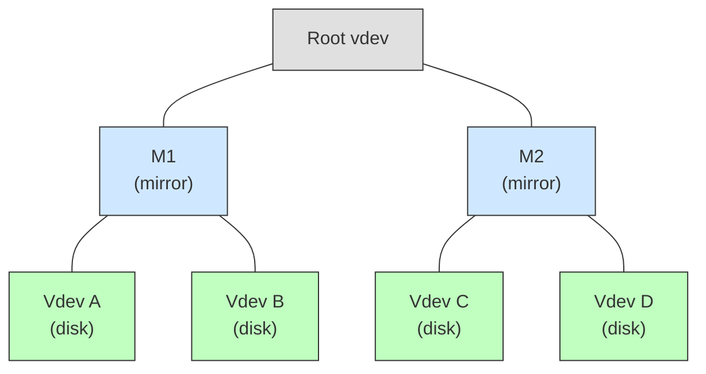

# Chapter 1: Virtual Devices (vdevs), Vdev Labels, and Boot Block

> **Source:** `include/sys/vdev_impl.h`, `include/sys/uberblock_impl.h`, `module/zfs/vdev.c`, `module/zfs/vdev_label.c`

## 1.1 Virtual Devices

ZFS storage pools are composed of virtual devices (vdevs). There are two kinds:

- **Physical vdevs** (leaf vdevs): Writable block devices such as disks or files.
- **Logical vdevs** (interior vdevs): Conceptual groupings of other vdevs providing redundancy or striping.

Vdevs form a tree. The root of every pool's vdev tree is a special logical vdev called the **root vdev**. Its direct children are **top-level vdevs**, which may be either physical devices or logical groupings (mirrors, RAID-Z, etc.).



In this example, M1 and M2 are top-level vdevs (mirrors). Vdevs A, B, C, and D are leaf vdevs (physical disks).

## 1.2 Vdev Labels

Each physical vdev contains a 256 KB structure called a **vdev label**. The label contains information describing the physical vdev and all other vdevs that share the same top-level vdev as ancestor. For example, the label on vdev C would describe vdevs C, D, and M2.

The vdev label serves two purposes:

1. Provides access to the pool's contents (via the uberblock).
2. Verifies pool integrity and availability (via the guid sum and configuration data).

### 1.2.1 Label Redundancy

Four copies of the label are written to each physical vdev. Two are placed at the front of the device and two at the back. This layout protects against localized corruption, since damage to one region of the device is unlikely to affect all four copies.

```
Offset:  0        256K       512K                             N-512K    N-256K    N
         +--------+--------+------ ··· ------+--------+--------+
         |   L0   |   L1   |                 |   L2   |   L3   |
         +--------+--------+------ ··· ------+--------+--------+
```

Where `N` is the total device size in bytes. L0 and L1 are the front labels; L2 and L3 are the back labels. Under normal conditions, all four labels on a given vdev are identical.

### 1.2.2 Transactional Two-Stage Label Update

Vdev labels occupy fixed positions and cannot use copy-on-write semantics. To ensure a valid label is always available, ZFS uses a two-stage update:

1. **Stage 1:** Write the even labels (L0 and L2). If the system fails during this stage, the odd labels (L1 and L3) remain valid.
2. **Stage 2:** Write the odd labels (L1 and L3). If the system fails during this stage, the even labels are already up to date.

This guarantees that at least two valid label copies exist on disk at all times.

## 1.3 Vdev Label Structure

Each 256 KB vdev label is divided into four sections:

```
Offset   Size     Section
──────   ──────   ─────────────────────────
0x00000   8 KB    Blank space
0x02000   8 KB    Boot block header
0x04000  112 KB   Name-value pair list (nvlist)
0x20000  128 KB   Uberblock array
──────   ──────
         256 KB   Total
```

```
Label (256 KB)
+──────────+──────────+────────────────────+─────────────────────+
| Blank    | Boot Hdr | Name/Value Pairs   | Uberblock Array     |
| 8 KB     | 8 KB     | 112 KB             | 128 KB              |
+──────────+──────────+────────────────────+─────────────────────+
0          8K         16K                   128K                  256K
```

### 1.3.1 Blank Space (8 KB)

The first 8 KB of the label is left empty. This accommodates VTOC (Volume Table of Contents) disk labels, which occupy the first 8 KB of slice 0 on Solaris systems. Leaving this space blank prevents ZFS label data from colliding with VTOC labels.

### 1.3.2 Boot Block Header (8 KB)

An 8 KB region reserved for boot support. This space is used on some platforms for boot loader data.

### 1.3.3 Name-Value Pair List (112 KB)

The next 112 KB stores a collection of name-value pairs encoded as an XDR nvlist. These pairs describe the vdev and all related vdevs in its top-level subtree.

The following top-level name-value pairs are present:

| Name | Type | Description |
|------|------|-------------|
| `version` | `uint64` | On-disk format version |
| `name` | `string` | Pool name |
| `state` | `uint64` | Pool state (see [Pool States](glossary.md#pool-states)) |
| `txg` | `uint64` | Transaction group when this label was written |
| `pool_guid` | `uint64` | Globally unique identifier for the pool |
| `top_guid` | `uint64` | GUID of the top-level vdev in this subtree |
| `guid` | `uint64` | GUID of this specific vdev |
| `vdev_tree` | `nvlist` | Recursive description of the vdev tree (see below) |

#### The `vdev_tree` Nvlist

The `vdev_tree` entry is a nested nvlist that recursively describes every vdev in the subtree rooted at this vdev's top-level vdev. Each `vdev_tree` nvlist may contain the following attributes:

| Name | Type | Description |
|------|------|-------------|
| `type` | `string` | Vdev type (see table below) |
| `id` | `uint64` | Index of this vdev in its parent's children array |
| `guid` | `uint64` | Globally unique identifier |
| `path` | `string` | Device path (leaf vdevs only) |
| `devid` | `string` | Device ID (disk vdevs only) |
| `metaslab_array` | `uint64` | Object number of the metaslab space map array |
| `metaslab_shift` | `uint64` | log2 of the metaslab size |
| `ashift` | `uint64` | log2 of the minimum allocatable unit (sector size) |
| `asize` | `uint64` | Allocatable space on this top-level vdev |
| `children` | `nvlist[]` | Array of child `vdev_tree` nvlists |

**Vdev Type Strings:**

| Type String | Description |
|-------------|-------------|
| `"disk"` | Leaf vdev: block storage device |
| `"file"` | Leaf vdev: file-backed storage |
| `"mirror"` | Interior vdev: mirror (N-way replication) |
| `"raidz"` | Interior vdev: RAID-Z (parity-based redundancy) |
| `"replacing"` | Interior vdev: temporary mirror used during disk replacement |
| `"root"` | Interior vdev: root of the vdev tree |

### 1.3.4 The Uberblock Array

The final 128 KB of the label holds an array of uberblocks. Each uberblock is 1 KB (2^10 bytes), giving 128 uberblock slots per label.

The **active uberblock** is the one with the highest transaction group number (`ub_txg`) and a valid SHA-256 checksum. The active uberblock is never overwritten in place; updates write to a different slot in the array in a round-robin fashion across the pool's vdevs.

> **Source:** `include/sys/uberblock_impl.h`

#### Uberblock Structure (`uberblock_t`)

```
Offset  Size     Field            Description
──────  ──────   ──────           ─────────────────────────────────────
0x000   8 bytes  ub_magic         Magic number: 0x00bab10c ("oo-ba-bloc")
0x008   8 bytes  ub_version       On-disk format version (SPA_VERSION)
0x010   8 bytes  ub_txg           Transaction group of last sync
0x018   8 bytes  ub_guid_sum      Sum of all leaf vdev GUIDs
0x020   8 bytes  ub_timestamp     UTC seconds since epoch (1970-01-01)
0x028   128 bytes ub_rootbp       Block pointer to the MOS (blkptr_t)
0x0A8   8 bytes  ub_software_version  Highest SPA_VERSION of writing software
0x0B0   8 bytes  ub_mmp_magic     MMP magic: 0xa11cea11 ("all-see-all")
0x0B8   8 bytes  ub_mmp_delay     Nanoseconds since last MMP write (0 = MMP off)
0x0C0   8 bytes  ub_mmp_config    MMP configuration (interval, seq, fail intervals)
0x0C8   8 bytes  ub_checkpoint_txg  Checkpoint transaction group (0 if not checkpoint)
0x0D0   8 bytes  ub_raidz_reflow_info  RAIDZ expansion reflow state and offset
──────  ──────
        ~224 bytes used; remainder of 1 KB slot is padding
```

**Key fields:**

- **`ub_magic`**: Identifies a device as containing ZFS data. On big-endian machines it reads `0x00bab10c`; on little-endian it reads `0x0cb1ba00`.
- **`ub_version`**: The SPA version number of the on-disk format.
- **`ub_txg`**: Must be >= the `txg` value in the nvlist for the label to be valid.
- **`ub_guid_sum`**: When a pool is opened, ZFS sums the GUIDs of all leaf vdevs and compares against this value to verify all devices are present.
- **`ub_timestamp`**: UTC time when this uberblock was written.
- **`ub_rootbp`**: A `blkptr_t` pointing to the Meta Object Set (MOS). This is the entry point to all pool data. See [Chapter 2](02-block-pointers.md).

The `ub_mmp_*` and later fields were added by post-2006 pool versions and feature flags. Older uberblocks may not contain them.

## 1.4 Boot Block

Between the front labels (L0, L1) and the back labels (L2, L3), a 3.5 MB region is reserved for boot support. Together with the labels, the first 4 MB of every vdev is reserved:

```
Offset:  0       256K      512K           4M                  N-512K    N-256K    N
         +-------+-------+---------------+---- ··· ----+-------+-------+
         |  L0   |  L1   |  Boot Block   |             |  L2   |  L3   |
         |       |       |  (3.5 MB)     |             |       |       |
         +-------+-------+---------------+---- ··· ----+-------+-------+
```

This is why DVA offsets start at 4 MB (`0x400000`): the physical byte address of a block is `(dva_offset << 9) + 0x400000`.
