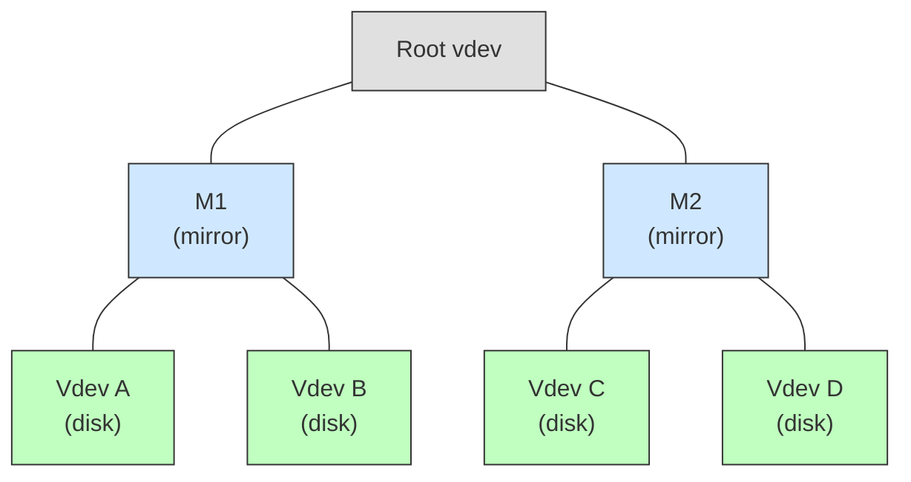
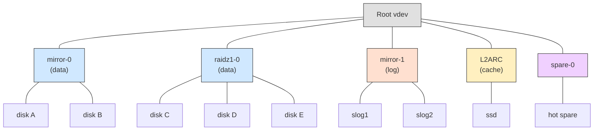

# Chapter 1: Virtual Devices (vdevs), Vdev Labels, and Boot Block

> **Source:** `include/sys/vdev_impl.h`, `include/sys/uberblock_impl.h`, `module/zfs/vdev.c`, `module/zfs/vdev_label.c`, `module/zfs/mmp.c`

## 1.1 Virtual Devices

ZFS storage pools are composed of virtual devices (vdevs). There are two kinds:

- **Physical vdevs** (leaf vdevs): Writable block devices such as disks or files.
- **Logical vdevs** (interior vdevs): Conceptual groupings of other vdevs providing redundancy or striping.

Vdevs form a tree. The root of every pool's vdev tree is a special logical vdev called the **root vdev**. Its direct children are **top-level vdevs**, which may be either physical devices or logical groupings (mirrors, RAID-Z, etc.).



In this example, M1 and M2 are top-level vdevs (mirrors). Vdevs A, B, C, and D are leaf vdevs (physical disks).

Modern pools often include additional special-purpose vdev classes alongside the main storage vdevs:



## 1.2 Vdev Labels

Each physical vdev contains a 256 KB structure called a **vdev label**. The label contains information describing the physical vdev and all other vdevs that share the same top-level vdev as ancestor. For example, the label on vdev C would describe vdevs C, D, and M2.

The vdev label serves two purposes:

1. Provides access to the pool's contents (via the uberblock).
2. Verifies pool integrity and availability (via the guid sum and configuration data).

### 1.2.1 Label Redundancy

Four copies of the label are written to each physical vdev. Two are placed at the front of the device and two at the back. This layout protects against localized corruption, since damage to one region of the device is unlikely to affect all four copies.

```
Offset:  0        256K       512K                             N-512K    N-256K    N
         +--------+--------+------ ··· ------+--------+--------+
         |   L0   |   L1   |                 |   L2   |   L3   |
         +--------+--------+------ ··· ------+--------+--------+
```

Where `N` is the total device size in bytes. L0 and L1 are the front labels; L2 and L3 are the back labels. Under normal conditions, all four labels on a given vdev are identical.

### 1.2.2 Transactional Two-Stage Label Update

Vdev labels occupy fixed positions and cannot use copy-on-write semantics. To ensure a valid label is always available, ZFS uses a two-stage update:

1. **Stage 1:** Write the even labels (L0 and L2). If the system fails during this stage, the odd labels (L1 and L3) remain valid.
2. **Stage 2:** Write the odd labels (L1 and L3). If the system fails during this stage, the even labels are already up to date.

This guarantees that at least two valid label copies exist on disk at all times.

## 1.3 Vdev Label Structure

Each 256 KB vdev label is divided into four sections:

```
Offset   Size     Section
──────   ──────   ─────────────────────────
0x00000   8 KB    Blank space
0x02000   8 KB    Boot block header
0x04000  112 KB   Name-value pair list (nvlist)
0x20000  128 KB   Uberblock array
──────   ──────
         256 KB   Total
```

```
Label (256 KB)
+──────────+──────────+────────────────────+─────────────────────+
| Blank    | Boot Hdr | Name/Value Pairs   | Uberblock Array     |
| 8 KB     | 8 KB     | 112 KB             | 128 KB              |
+──────────+──────────+────────────────────+─────────────────────+
0          8K         16K                   128K                  256K
```

### 1.3.1 Blank Space (8 KB)

The first 8 KB of the label is left empty. This accommodates VTOC (Volume Table of Contents) disk labels, which occupy the first 8 KB of slice 0 on Solaris systems. Leaving this space blank prevents ZFS label data from colliding with VTOC labels.

### 1.3.2 Boot Environment Block (8 KB)

An 8 KB region originally reserved for boot support. In modern OpenZFS, this region stores a **boot environment block** (`vdev_boot_envblock_t`) used by the GRUB bootloader on Linux to persist boot environment variables (the `grubenv` file).

> **Source:** `include/sys/vdev_impl.h`

```
vdev_boot_envblock_t (8192 bytes)
Offset  Size       Field          Description
──────  ─────      ─────          ──────────────────────────────────
0x000   8 bytes    vbe_version    Format version (see below)
0x008   8048 bytes vbe_bootenv    Boot environment payload
0x1F78  136 bytes  vbe_zbt        Embedded checksum (zio_eck_t)
──────  ─────
        8192 bytes total
```

| Version | Constant | Payload Format |
|---------|----------|----------------|
| 0 | `VB_RAW` | Raw ASCII text (GRUB `grubenv` format), protected by embedded checksum |
| 1 | `VB_NVLIST` | Packed nvlist |

### 1.3.3 Name-Value Pair List (112 KB)

The next 112 KB stores a collection of name-value pairs encoded as an XDR nvlist. These pairs describe the vdev and all related vdevs in its top-level subtree.

The following top-level name-value pairs are present:

| Name | Type | Description |
|------|------|-------------|
| `version` | `uint64` | On-disk format version (1-28, or 5000 for feature flags) |
| `name` | `string` | Pool name |
| `state` | `uint64` | Pool state (see [Pool States](glossary.md#pool-states)) |
| `txg` | `uint64` | Transaction group when this label was written |
| `pool_guid` | `uint64` | Globally unique identifier for the pool |
| `top_guid` | `uint64` | GUID of the top-level vdev in this subtree |
| `guid` | `uint64` | GUID of this specific vdev |
| `vdev_tree` | `nvlist` | Recursive description of the vdev tree (see below) |
| `features_for_read` | `nvlist` | Feature GUIDs required to read this pool (version 5000 only; see [Section 1.6](#16-pool-versioning)) |
| `hostid` | `uint64` | Host ID of the machine that last had the pool imported |
| `hostname` | `string` | Hostname of the machine that last had the pool imported |

The `features_for_read` nvlist is present only when `version` is 5000. Each entry in this nvlist has a feature GUID string as the name and a `uint64` value of 0 as the value. The set of features listed here is checked during pool import: if the importing software does not recognize all listed feature GUIDs, it refuses to open the pool. This allows the label to be read without accessing the MOS, which is necessary to determine whether the pool can be imported at all.

#### The `vdev_tree` Nvlist

The `vdev_tree` entry is a nested nvlist that recursively describes every vdev in the subtree rooted at this vdev's top-level vdev. Each `vdev_tree` nvlist may contain the following attributes:

| Name | Type | Description |
|------|------|-------------|
| `type` | `string` | Vdev type (see table below) |
| `id` | `uint64` | Index of this vdev in its parent's children array |
| `guid` | `uint64` | Globally unique identifier |
| `path` | `string` | Device path (leaf vdevs only) |
| `devid` | `string` | Device ID (disk vdevs only) |
| `metaslab_array` | `uint64` | Object number of the metaslab space map array |
| `metaslab_shift` | `uint64` | log2 of the metaslab size |
| `ashift` | `uint64` | log2 of the minimum allocatable unit (sector size) |
| `asize` | `uint64` | Allocatable space on this top-level vdev |
| `children` | `nvlist[]` | Array of child `vdev_tree` nvlists |

**Vdev Type Strings:**

| Type String | Added | Description |
|-------------|-------|-------------|
| `"disk"` | v1 | Leaf vdev: block storage device |
| `"file"` | v1 | Leaf vdev: file-backed storage |
| `"mirror"` | v1 | Interior vdev: mirror (N-way replication) |
| `"raidz"` | v1 | Interior vdev: RAID-Z (parity-based redundancy) |
| `"replacing"` | v1 | Interior vdev: temporary mirror used during disk replacement |
| `"root"` | v1 | Interior vdev: root of the vdev tree |
| `"spare"` | v3 | Leaf vdev: hot spare device |
| `"log"` | v7 | Interior vdev: dedicated ZIL log device (SLOG) |
| `"l2cache"` | v10 | Leaf vdev: L2ARC read cache device |
| `"hole"` | v19 | Placeholder for a removed top-level vdev slot |
| `"missing"` | -- | Placeholder for a device that is not present at import |
| `"indirect"` | feature | Remapped vdev after device removal (`feature@device_removal`) |
| `"draid"` | feature | Distributed-parity RAID with integrated spares (`feature@draid`) |
| `"dspare"` | feature | Distributed spare within a dRAID group (`feature@draid`) |

### 1.3.4 The Uberblock Array

The final 128 KB of the label holds an array of uberblocks. The size of each uberblock slot depends on the device's sector size (ashift); see [Section 1.5](#15-ashift-and-uberblock-slot-sizing). With the default 1 KB slot size (ashift <= 10), the array holds 128 slots.

The **active uberblock** is the one with the highest transaction group number (`ub_txg`) and a valid SHA-256 checksum. The active uberblock is never overwritten in place; updates write to a different slot in the array in a round-robin fashion across the pool's vdevs.

> **Source:** `include/sys/uberblock_impl.h`

#### Uberblock Structure (`uberblock_t`)

```
Offset  Size       Field                Description
──────  ──────     ──────               ─────────────────────────────────────
0x000   8 bytes    ub_magic             Magic number: 0x00bab10c
0x008   8 bytes    ub_version           On-disk format version (SPA_VERSION)
0x010   8 bytes    ub_txg               Transaction group of last sync
0x018   8 bytes    ub_guid_sum          Sum of all leaf vdev GUIDs
0x020   8 bytes    ub_timestamp         UTC seconds since epoch (1970-01-01)
0x028   128 bytes  ub_rootbp            Block pointer to the MOS (blkptr_t)
0x0A8   8 bytes    ub_software_version  Highest SPA_VERSION of writing software
0x0B0   8 bytes    ub_mmp_magic         MMP magic: 0xa11cea11
0x0B8   8 bytes    ub_mmp_delay         Nanoseconds since last MMP write
0x0C0   8 bytes    ub_mmp_config        MMP configuration bitfield
0x0C8   8 bytes    ub_checkpoint_txg    Checkpoint transaction group
0x0D0   8 bytes    ub_raidz_reflow_info RAIDZ expansion reflow state
──────  ──────
        ~224 bytes used; remainder of slot is zero-padding
```

#### Field Descriptions

**`ub_magic`** (0x000): Identifies a device as containing ZFS data. The magic value `0x00bab10c` also serves as an endianness indicator: on big-endian machines it reads `0x00bab10c`; on little-endian it reads `0x0cb1ba00`.

**`ub_version`** (0x008): The SPA version number of the on-disk format. Values 1-28 indicate a specific pool version. The value 5000 indicates the feature-flags system (see [Section 1.6](#16-pool-versioning)).

**`ub_txg`** (0x010): The transaction group number of the last successful sync. Must be >= the `txg` value in the label's nvlist for this uberblock to be considered valid.

**`ub_guid_sum`** (0x018): The sum of all leaf vdev GUIDs. When a pool is opened, ZFS sums the GUIDs of all discovered leaf vdevs and compares against this value to verify all devices are present.

**`ub_timestamp`** (0x020): UTC seconds since 1970-01-01 when this uberblock was written.

**`ub_rootbp`** (0x028): A `blkptr_t` pointing to the Meta Object Set (MOS). This is the entry point to all pool data. See [Chapter 2](02-block-pointers.md).

**`ub_software_version`** (0x0A8, added in pool version 2): Records the highest `SPA_VERSION` that the writing software supports, which may be higher than `ub_version`. This enables forward compatibility: software that supports a newer pool version can write uberblocks to a pool running an older version without upgrading the pool's on-disk format.

**`ub_mmp_magic`** (0x0B0): Set to `0xa11cea11` when MMP fields are valid. See [Section 1.7](#17-multi-modifier-protection-mmp).

**`ub_mmp_delay`** (0x0B8): Nanoseconds between the two most recent MMP writes. If `ub_mmp_delay == 0` and `ub_mmp_magic` is valid, MMP is not active.

**`ub_mmp_config`** (0x0C0): A bitfield encoding the MMP write interval, sequence counter, and fail intervals. See [Section 1.7](#17-multi-modifier-protection-mmp) for the bit layout.

**`ub_checkpoint_txg`** (0x0C8, `feature@zpool_checkpoint`): When a pool checkpoint is active, this field stores the transaction group of the checkpoint. The checkpoint preserves the pool's state at this txg, allowing the administrator to rewind the entire pool to this point. Zero when no checkpoint is active.

**`ub_raidz_reflow_info`** (0x0D0, `feature@raidz_expansion`): Encodes the state of a RAIDZ expansion (reflow) operation. The field combines a byte offset and state flag:

```
ub_raidz_reflow_info
63                                                  1   0
+──────────────────────────────────────────────────+───+
|             reflow_offset (bytes)                | S |
+──────────────────────────────────────────────────+───+
```

| Bits | Field | Description |
|------|-------|-------------|
| 63:1 | `reflow_offset` | Byte offset up to which data has been reflowed onto the new vdev layout |
| 0 | `state` | 0 = not in progress, 1 = reflow in progress |

Fields from `ub_software_version` onward were added after the original 2006 format. Older uberblocks may not contain them; uninitialized fields read as zero.

## 1.4 Boot Block

Between the front labels (L0, L1) and the back labels (L2, L3), a 3.5 MB region is reserved for boot support. Together with the labels, the first 4 MB of every vdev is reserved:

```
Offset:  0       256K      512K           4M                  N-512K    N-256K    N
         +-------+-------+---------------+---- ··· ----+-------+-------+
         |  L0   |  L1   |  Boot Block   |             |  L2   |  L3   |
         |       |       |  (3.5 MB)     |             |       |       |
         +-------+-------+---------------+---- ··· ----+-------+-------+
```

This is why DVA offsets start at 4 MB (`0x400000`): the physical byte address of a block is `(dva_offset << 9) + 0x400000`.

## 1.5 Ashift and Uberblock Slot Sizing

> **Source:** `include/sys/vdev_impl.h`

The **ashift** (alignment shift) of a vdev is the log2 of the device's minimum I/O size (sector size). Modern OpenZFS supports ashift values from 9 to 16:

| Ashift | Sector Size | Common Devices |
|--------|-------------|----------------|
| 9 | 512 bytes | Traditional HDDs |
| 12 | 4 KB | Advanced Format HDDs, most SSDs |
| 13 | 8 KB | Some enterprise SSDs |
| 14 | 16 KB | Some NVMe devices |
| 16 | 64 KB | Some cloud block storage |

Ashift is set at vdev creation time (auto-detected or overridden) and cannot be changed afterwards. It affects the minimum size of all I/O to the device, including uberblock writes.

### Uberblock Slot Sizing

The uberblock slot size is determined by the ashift of the top-level vdev:

```
slot_shift = MIN(MAX(ashift, 10), 13)
slot_size  = 2^slot_shift
slot_count = 128 KB / slot_size
```

| Ashift | Slot Size | Slots per Label |
|--------|-----------|-----------------|
| 9-10 | 1 KB | 128 |
| 11 | 2 KB | 64 |
| 12 | 4 KB | 32 |
| 13+ | 8 KB | 16 |

The uberblock data structure (~224 bytes) is always the same; only the slot padding changes. Fewer slots mean the uberblock ring wraps more frequently, but all slots remain usable.

## 1.6 Pool Versioning

> **Source:** `include/sys/fs/zfs.h`, `include/zfeature_common.h`, `module/zcommon/zfeature_common.c`

ZFS has used two versioning mechanisms over its history: numbered pool versions and feature flags.

### Pool Versions 1-28

The original versioning scheme uses a single integer stored in `ub_version` and in the label nvlist's `version` field. Each version adds one or more on-disk format capabilities. A pool at version N supports all features from versions 1 through N.

| Version | Features |
|---------|----------|
| 1 | Initial ZFS format |
| 2 | Ditto blocks (replicated metadata) |
| 3 | Hot spares, RAID-Z2, bpobj accounting, RAID-Z deflate, dnode bytes |
| 4 | Pool history (zpool history) |
| 5 | GZIP compression |
| 6 | Boot filesystem support |
| 7 | Separate intent log devices (SLOG) |
| 8 | Delegated administration |
| 9 | FUID (file user/group ID mapping), refquota, refreservation |
| 10 | L2ARC read cache devices |
| 11 | Next clones, origin, DSL scrub |
| 12 | Snapshot properties |
| 13 | Used space breakdown (usedsnap, usedds, usedchild, usedrefreserv) |
| 14 | Passthrough-x (execute permission passthrough) |
| 15 | User/group space accounting |
| 16 | STMF (SCSI Target Mode Framework) properties |
| 17 | RAID-Z3 (triple parity) |
| 18 | User reference holds on snapshots |
| 19 | Hole support for vdev removal placeholders |
| 20 | ZLE (Zero-Length Encoding) compression |
| 21 | Deduplication |
| 22 | Received properties |
| 23 | Slim ZIL (more compact intent log records) |
| 24 | System attributes (SA) -- bonus buffer replacement |
| 25 | Improved pool scrub/scan |
| 26 | Directory-based clone tracking, improved deadlists |
| 27 | Fast snapshot creation |
| 28 | Multiple device replacement, last numbered version |
| 5000 | Feature flags system (see below) |

### The Oracle/OpenZFS Divergence

Pool version 28 is the last version common to all ZFS implementations. After the OpenSolaris project ended in 2010, ZFS development split:

- **Oracle Solaris** continued the numbered version scheme, reaching [pool version 53](https://docs.oracle.com/en/operating-systems/solaris/oracle-solaris/11.4/manage-zfs/zfs-pool-versions.html) in Solaris 11.4. These versions added features like encryption, LZMA compression, and others specific to Oracle's implementation.
- **OpenZFS** (illumos, FreeBSD, Linux, macOS) stopped at pool version 28 and adopted the **feature flags** system instead.

The two implementations have diverged and are **no longer on-disk format compatible**. A pool created by Oracle Solaris at version 29 or later cannot be imported by OpenZFS, and vice versa for pools using OpenZFS feature flags.

### Feature Flags (Version 5000)

When `ub_version` is 5000, the pool uses the feature flag system instead of numbered versions. Individual features are identified by reverse-DNS GUIDs (e.g., `com.delphix:async_destroy`) and can be independently enabled or disabled.

#### Feature State

Each feature has one of three states:

| State | Description |
|-------|-------------|
| **Disabled** | Feature is not active and has no on-disk impact |
| **Enabled** | Feature is active but not currently in use (reference count = 0); pool can be imported by software that does not support this feature |
| **Active** | Feature is in use (reference count > 0); pool **cannot** be imported by software that does not support this feature |

#### On-Disk Storage

Feature state is tracked in three ZAP objects in the MOS (Meta Object Set), referenced from the MOS object directory:

| MOS Object Directory Entry | Contents |
|---------------------------|----------|
| `features_for_read` | ZAP mapping feature GUIDs to reference counts, for features required to **read** the pool. Software that does not recognize an active feature in this set must refuse to import the pool. |
| `features_for_write` | ZAP mapping feature GUIDs to reference counts, for features required only to **write** to the pool. The pool can still be imported read-only by software that does not recognize these features. |
| `feature_descriptions` | ZAP mapping feature GUIDs to human-readable description strings. Informational only. |

In addition, the vdev label's nvlist contains a `features_for_read` entry (see [Section 1.3.3](#133-name-value-pair-list-112-kb)) that duplicates the set of active read-required feature GUIDs. This allows pool import logic to check feature compatibility without reading the MOS.

See the [Glossary](glossary.md#feature-flags) for the complete list of feature flags and their GUIDs.

## 1.7 Multi-Modifier Protection (MMP)

> **Source:** `include/sys/mmp.h`, `module/zfs/mmp.c`

Multi-Modifier Protection (MMP) prevents a pool from being imported simultaneously on multiple hosts, which would cause catastrophic data corruption. MMP is controlled by the `multihost` pool property.

### Mechanism

When MMP is active, the system periodically writes uberblocks to the pool as a heartbeat signal. Each MMP write updates `ub_mmp_delay` with the time elapsed since the previous MMP write (in nanoseconds). Before importing a pool, the importing system checks the uberblock ring for evidence of recent MMP writes from another host. If such evidence is found, import is refused.

The MMP heartbeat writes go to uberblock slots in round-robin order, using `ub_txg = 0` so they are never selected as the active uberblock. These writes serve only as presence indicators.

### `ub_mmp_config` Bit Layout

The `ub_mmp_config` field packs three values and three validity bits into a single 64-bit word:

```
ub_mmp_config (64 bits)
63              48 47              32 31               8 7  2  1  0
+────────────────+─────────────────+──────────────────+──+──+──+──+
| Fail Intervals |    Sequence     |  Write Interval  |  |F |Q |V |
|   (16 bits)    |   (16 bits)     |    (24 bits)     |  |  |  |  |
+────────────────+─────────────────+──────────────────+──+──+──+──+
```

| Bits | Field | Description |
|------|-------|-------------|
| 63:48 | Fail Intervals | Number of failed MMP write intervals before the pool is suspended (tunable `zfs_multihost_fail_intervals`, default 10) |
| 47:32 | Sequence | Monotonically increasing counter, incremented on each MMP write |
| 31:8 | Write Interval | MMP write interval in milliseconds (tunable `zfs_multihost_interval`, default 1000) |
| 2 | `F` (Fail Int Valid) | Set to 1 if the Fail Intervals field is valid |
| 1 | `Q` (Seq Valid) | Set to 1 if the Sequence field is valid |
| 0 | `V` (Interval Valid) | Set to 1 if the Write Interval field is valid |

The validity bits handle backward compatibility: older software that wrote `ub_mmp_config = 0` did not populate these fields. When a validity bit is not set, the importing system uses default values.

### Import Safety

During pool import, the system waits for a duration derived from the uberblock's MMP fields to confirm that no other host is actively using the pool. The wait duration is:

```
wait = ub_mmp_delay * zfs_multihost_import_intervals
```

where `zfs_multihost_import_intervals` defaults to 20. This provides a safety margin of 20x the observed write interval. If the `ub_mmp_config` fields are valid, the configured `Fail Intervals` and `Write Interval` are also considered.
