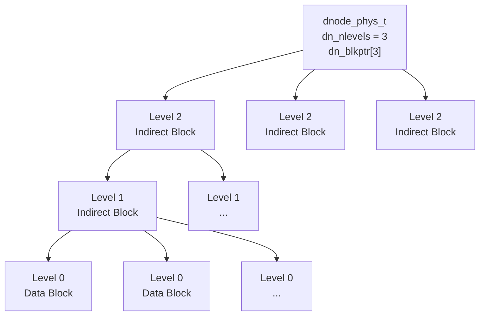
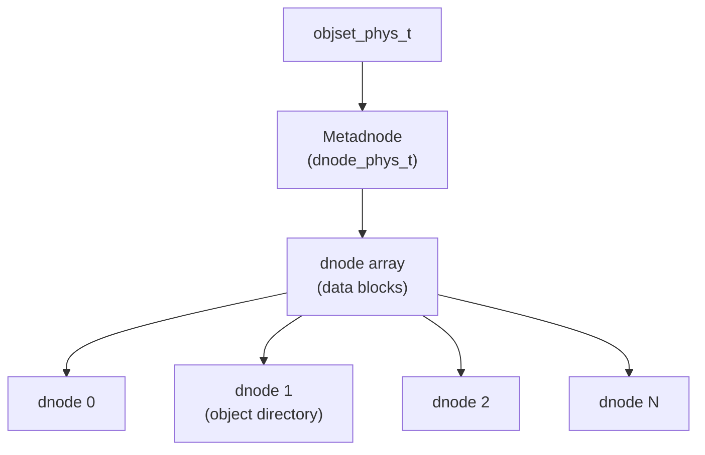

# Chapter 3: Data Management Unit (DMU)

> **Source:** `include/sys/dmu.h`, `include/sys/dnode.h`, `include/sys/dmu_objset.h`, `module/zfs/dmu.c`, `module/zfs/dmu_objset.c`

The Data Management Unit (DMU) consumes blocks (described by block pointers, see [Chapter 2](02-block-pointers.md)) and groups them into logical units called **objects**. Objects are further grouped into **object sets**. The DMU provides the foundation on which all higher layers (DSL, ZAP, ZPL, ZVOL) are built.

## 3.1 Objects

With the exception of the vdev label infrastructure (Chapter 1) and block pointers (Chapter 2), everything in ZFS is an object. Each object has a type that determines how its data is interpreted. See the [glossary](glossary.md#dmu-object-types) for the complete list of object types.

### The Dnode (`dnode_phys_t`)

Objects are described by 512-byte structures called **dnodes**. A dnode organizes the collection of blocks that make up an object. It contains metadata about the object and block pointers to its data.

> **Source:** `include/sys/dnode.h` -- `DNODE_SHIFT = 9` (512 bytes), `DNODE_CORE_SIZE = 64` bytes

```
dnode_phys_t (512 bytes)
Offset  Size      Field               Description
──────  ────      ─────               ───────────────────────────────────
0x00    1 byte    dn_type             Object type (see glossary)
0x01    1 byte    dn_indblkshift      log2(indirect block size in bytes)
0x02    1 byte    dn_nlevels          Number of levels of indirection
0x03    1 byte    dn_nblkptr          Number of block pointers (1-3)
0x04    1 byte    dn_bonustype        Type of data in bonus buffer
0x05    1 byte    dn_checksum         Checksum algorithm for this object
0x06    1 byte    dn_compress         Compression algorithm for this object
0x07    1 byte    dn_flags            Dnode flags (see below)
0x08    2 bytes   dn_datablkszsec     Data block size in 512-byte sectors
0x0A    2 bytes   dn_bonuslen         Length of bonus buffer in bytes
0x0C    1 byte    dn_extra_slots      Extra dnode slots consumed (0 = standard)
0x0D    3 bytes   dn_pad2             Reserved (protected by encryption MAC)
0x10    8 bytes   dn_maxblkid         Largest level-0 block ID
0x18    8 bytes   dn_used             Space used (bytes or sectors, see flags)
0x20    32 bytes  dn_pad3             Reserved (protected by encryption MAC)
0x40    variable  dn_blkptr[N]        Block pointer array (N = dn_nblkptr)
        variable  dn_bonus            Bonus buffer (dn_bonuslen bytes)
        128 bytes dn_spill            Spill block pointer (if SPILL_BLKPTR set)
──────  ────
        512 bytes total (minimum; large dnodes may be multiples of 512)
```

**Field details:**

- **`dn_type`**: Identifies the object type. A value of `DMU_OT_NONE` (0) indicates a free/unallocated dnode. See the [glossary](glossary.md#dmu-object-types) for all type values. Types above 0x80 use the new-type encoding (see [Section 3.5](#35-new-type-encoding)).

- **`dn_indblkshift`** and **`dn_datablkszsec`**: ZFS supports variable block sizes from 512 bytes to 128 KB (and beyond with `large_blocks` feature). `dn_indblkshift` is log2 of the indirect block size (range: 12-17, i.e. 4 KB to 128 KB). `dn_datablkszsec` is the data block size divided by 512.

- **`dn_nblkptr`** and **`dn_blkptr`**: The dnode contains between 1 and 3 block pointers (`DN_MAX_NBLKPTR = 3`). This is set at object creation time and remains constant. The block pointer array is at offset 0x40 within the dnode.

- **`dn_nlevels`**: The number of levels of indirection (see [Section 3.2](#32-indirection)).

- **`dn_maxblkid`**: The largest level-0 (data) block ID for this object. Block IDs are sequential starting from 0.

- **`dn_used`**: Total allocated space for all blocks (data and indirect) of this object. If the `DNODE_FLAG_USED_BYTES` flag is set, this value is in bytes; otherwise it is in multiples of 512 bytes.

- **`dn_flags`**: Bitfield controlling dnode behavior:

| Bit | Flag | Description |
|-----|------|-------------|
| 0 | `DNODE_FLAG_USED_BYTES` | `dn_used` is in bytes (not 512-byte sectors) |
| 1 | `DNODE_FLAG_USERUSED_ACCOUNTED` | User/group space accounting is up to date |
| 2 | `DNODE_FLAG_SPILL_BLKPTR` | Dnode has a spill block pointer (see [Section 3.4](#34-spill-blocks)) |
| 3 | `DNODE_FLAG_USEROBJUSED_ACCOUNTED` | User/group/project object accounting is up to date |

- **`dn_extra_slots`**: Number of additional 512-byte slots consumed beyond the first. A standard 512-byte dnode has `dn_extra_slots = 0`. A 1024-byte dnode has `dn_extra_slots = 1`. See [Section 3.3](#33-large-dnodes).

- **`dn_pad2`** and **`dn_pad3`**: Reserved for future use. When encryption is enabled, these fields are protected by the block's MAC (message authentication code).

- **`dn_bonus`**, **`dn_bonuslen`**, **`dn_bonustype`**: The bonus buffer is the space following the block pointer array within the dnode. It stores inline metadata whose format is determined by `dn_bonustype`. Common bonus buffer types:

| Bonus Type | Structure | Description |
|------------|-----------|-------------|
| `DMU_OT_PACKED_NVLIST_SIZE` | `uint64_t` | Size of a packed nvlist object |
| `DMU_OT_SPACE_MAP_HEADER` | `space_map_obj_t` | Space map header |
| `DMU_OT_DSL_DIR` | `dsl_dir_phys_t` | DSL directory metadata |
| `DMU_OT_DSL_DATASET` | `dsl_dataset_phys_t` | DSL dataset metadata |
| `DMU_OT_ZNODE` | `znode_phys_t` | ZPL file metadata (legacy) |
| `DMU_OT_SA` | SA layout | System attributes (modern, see [Chapter 6](06-zpl.md)) |

## 3.2 Indirection

A dnode has a limited number of block pointers (1-3). With the maximum data block size of 128 KB and 3 block pointers, the largest object representable without indirection is 384 KB (3 x 128 KB).

To support larger objects, ZFS uses **indirect blocks**. An indirect block is a block filled with block pointers. The number of block pointers per indirect block depends on its size: an indirect block of size `S` holds `S / 128` block pointers (since each `blkptr_t` is 128 bytes). A 128 KB indirect block holds 1024 block pointers.

Levels of indirection are numbered from the bottom:
- **Level 0**: Data blocks (actual file/object data)
- **Level 1**: Indirect blocks containing pointers to level-0 blocks
- **Level 2**: Indirect blocks containing pointers to level-1 blocks
- And so on, up to 6 levels maximum



Given a block ID, ZFS can determine which branch of indirect blocks contains the data block by dividing the block ID by the number of block pointers per indirect block at each level. For example, with 1024 pointers per indirect block, level-0 block ID 16360 maps to level-1 block ID 15 (16360 / 1024 = 15, remainder 1000).

ZFS supports up to 6 levels of indirection, enabling objects up to 2^64 bytes.

## 3.3 Large Dnodes

> **Source:** `include/sys/dnode.h` -- feature `org.zfsonlinux:large_dnode`

The original ZFS format uses a fixed 512-byte dnode (`DNODE_SHIFT = 9`). The `large_dnode` feature allows dnodes to be multiples of 512 bytes, up to 16 KB:

| Constant | Value | Description |
|----------|-------|-------------|
| `DNODE_MIN_SIZE` | 512 bytes | Minimum (and original) dnode size |
| `DNODE_MAX_SIZE` | 16,384 bytes | Maximum dnode size (1 << `DNODE_BLOCK_SHIFT`) |
| `DNODE_MIN_SLOTS` | 1 | Slots consumed by a 512-byte dnode |
| `DNODE_MAX_SLOTS` | 32 | Slots consumed by a 16 KB dnode |

A large dnode occupies consecutive slots in the metadnode's dnode array. The `dn_extra_slots` field records how many additional 512-byte slots beyond the first are consumed. A 1024-byte dnode has `dn_extra_slots = 1`; a 16 KB dnode has `dn_extra_slots = 31`. The extra slots are unavailable for other objects and appear as `DMU_OT_NONE` with a special marker.

The primary benefit of large dnodes is a larger bonus buffer:

```
Bonus buffer size = dnode_size - DNODE_CORE_SIZE - sizeof(blkptr_t)
                  = dnode_size - 64 - 128
                  = dnode_size - 192
```

| Dnode Size | Bonus Buffer | Spill Avoided For |
|------------|-------------|-------------------|
| 512 bytes | 320 bytes | Small metadata |
| 1,024 bytes | 832 bytes | Most SA layouts |
| 2,048 bytes | 1,856 bytes | Large xattr sets |
| 16,384 bytes | 16,192 bytes | Nearly all use cases |

The `dnodesize` dataset property controls the dnode size for new objects. Existing objects retain their original dnode size.

## 3.4 Spill Blocks

> **Source:** `include/sys/dnode.h` -- added in pool version 24 (System Attributes)

When metadata (typically System Attributes) exceeds the bonus buffer capacity, the overflow is stored in a **spill block**. The spill block pointer is a standard 128-byte `blkptr_t` stored at the end of the dnode's tail region:

```
Standard 512-byte dnode with spill block (dn_nblkptr = 1):

Offset  Size       Field
──────  ────       ─────
0x00    64 bytes   Dnode core (dn_type through dn_pad3)
0x40    128 bytes  dn_blkptr[0]
0xC0    192 bytes  dn_bonus (bonus buffer, reduced from 320 bytes)
0x180   128 bytes  dn_spill (spill block pointer)
──────  ────
        512 bytes total
```

The spill block pointer is present only when `DNODE_FLAG_SPILL_BLKPTR` (bit 2 of `dn_flags`) is set. Its location is calculated as:

```
spill_offset = (dn_extra_slots + 1) × 512 - 128
```

For a standard 512-byte dnode, this places it at offset 384 (0x180). For a 1024-byte dnode, at offset 896 (0x380). The spill block pointer always occupies the last 128 bytes of the dnode.

When a spill block is present, the bonus buffer shrinks to accommodate it. The maximum bonus length becomes:

```
max_bonus = spill_offset - DNODE_CORE_SIZE - (dn_nblkptr × 128)
```

Spill blocks are primarily used by System Attributes (SA). See [Chapter 6](06-zpl.md) for how SAs use the bonus buffer and spill block to store file metadata.

## 3.5 New-Type Encoding

> **Source:** `include/sys/dmu.h` -- added with feature `com.delphix:extensible_dataset`

The original DMU object type space (values 0-53) was a fixed enumeration. To allow new object types without exhausting the type space, a new encoding scheme was introduced. Types with bit 7 set (`>= 0x80`) use the following layout in the `dn_type` byte:

```
Bit     Field
───     ─────
7       DMU_OT_NEWTYPE    (1 = new-type encoding)
6       DMU_OT_METADATA   (1 = metadata, 0 = data)
5       DMU_OT_ENCRYPTED  (1 = encrypted)
4-0     DMU_OT_BYTESWAP   (byteswap function index)
```

Byteswap function indices:

| Value | Constant | Description |
|-------|----------|-------------|
| 0 | `DMU_BSWAP_UINT8` | Byte array (no swap needed) |
| 1 | `DMU_BSWAP_UINT16` | 16-bit integer array |
| 2 | `DMU_BSWAP_UINT32` | 32-bit integer array |
| 3 | `DMU_BSWAP_UINT64` | 64-bit integer array |
| 4 | `DMU_BSWAP_ZAP` | ZAP block |

This encoding allows any combination of byteswap function, metadata flag, and encryption flag to be expressed in a single byte, without needing to add new entries to the legacy type table.

## 3.6 Object Sets

The DMU groups related objects into **object sets**. Each object set represents a filesystem, snapshot, clone, or volume. Object sets are described by the `objset_phys_t` structure, which has grown over time to accommodate user/group/project space accounting and encryption.

> **Source:** `include/sys/dmu_objset.h`

The structure exists in three on-disk versions. The version is determined by the buffer size, not by an explicit version field:

| Version | Size | Added Features |
|---------|------|----------------|
| V1 | 1,024 bytes | Original: metadnode, ZIL header, type |
| V2 | 2,048 bytes | User/group space accounting, encryption MACs |
| V3 | 4,096 bytes | Project quota accounting |

```
objset_phys_t (V3 layout, 4096 bytes)
Offset  Size       Field                  Description
──────  ────       ─────                  ───────────────────────────────
0x000   512 bytes  os_meta_dnode          Metadnode (dnode_phys_t)
0x200   192 bytes  os_zil_header          ZIL header (see Chapter 7)
0x2C0   8 bytes    os_type                Object set type (see below)
0x2C8   8 bytes    os_flags               Flags (see below)
0x2D0   32 bytes   os_portable_mac        Portable MAC (encryption, raw send)
0x2F0   32 bytes   os_local_mac           Local MAC (encryption)
0x310   240 bytes  os_pad0                Reserved
0x400   512 bytes  os_userused_dnode      User space accounting (V2+)
0x600   512 bytes  os_groupused_dnode     Group space accounting (V2+)
0x800   512 bytes  os_projectused_dnode   Project space accounting (V3+)
0xA00   1536 bytes os_pad1                Reserved
──────  ────
        4096 bytes total (V3)
```

**Object Set Types:**

| Value | Constant | Description |
|-------|----------|-------------|
| 0 | `DMU_OST_NONE` | Uninitialized |
| 1 | `DMU_OST_META` | Meta Object Set (one per pool) |
| 2 | `DMU_OST_ZFS` | ZPL filesystem, snapshot, or clone |
| 3 | `DMU_OST_ZVOL` | ZFS volume |

**Object Set Flags (`os_flags`):**

| Bit | Flag | Description |
|-----|------|-------------|
| 0 | `OBJSET_FLAG_USERACCOUNTING_COMPLETE` | User/group space accounting is initialized |
| 1 | `OBJSET_FLAG_USEROBJACCOUNTING_COMPLETE` | User/group object count accounting is initialized |
| 2 | `OBJSET_FLAG_PROJECTQUOTA_COMPLETE` | Project quota accounting is initialized |

**Encryption Fields:**

The `os_portable_mac` and `os_local_mac` fields (32 bytes each) are used when the dataset is encrypted. The portable MAC authenticates fields that must survive a raw `zfs send` (the object set type and portable dnode flags). The local MAC authenticates all protected fields including those that may change across send/receive. Both fields are zeroed for unencrypted datasets.

**Accounting Dnodes:**

The `os_userused_dnode`, `os_groupused_dnode`, and `os_projectused_dnode` are full `dnode_phys_t` structures embedded directly in the object set. Their data blocks contain ZAP objects that map UIDs/GIDs/project IDs to space usage. These are accessed via special pseudo-object numbers:

| Pseudo-Object Number | Field | Feature |
|---------------------|-------|---------|
| `DMU_USERUSED_OBJECT` (-1) | `os_userused_dnode` | Pool version 15 |
| `DMU_GROUPUSED_OBJECT` (-2) | `os_groupused_dnode` | Pool version 15 |
| `DMU_PROJECTUSED_OBJECT` (-3) | `os_projectused_dnode` | `feature@project_quota` |

### 3.6.1 The Metadnode

The first member of every object set is the **metadnode** -- a `dnode_phys_t` whose data blocks contain an array of `dnode_phys_t` structures, one for each object in the object set. This metadnode-of-dnodes pattern provides the indexed storage for all objects.

Each object is identified by a 64-bit **object number**, which is the index into the metadnode's dnode array. Object 0 is the metadnode itself. Conventionally, object 1 has a well-known purpose:

- In the MOS (`DMU_OST_META`): Object 1 is the **object directory** (a ZAP object).
- In ZPL object sets (`DMU_OST_ZFS`): Object 1 is the **master node** (a ZAP object).
- In ZVOL object sets (`DMU_OST_ZVOL`): Object 1 is the **ZVOL data** object.


