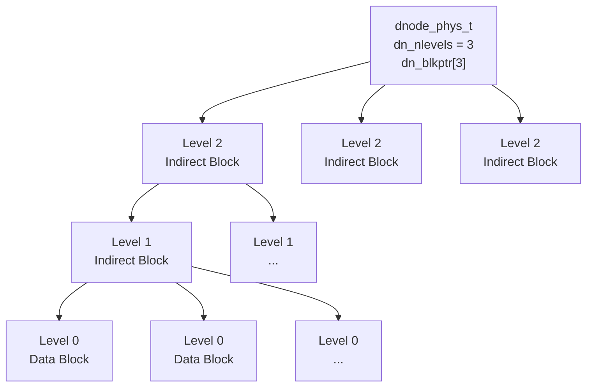
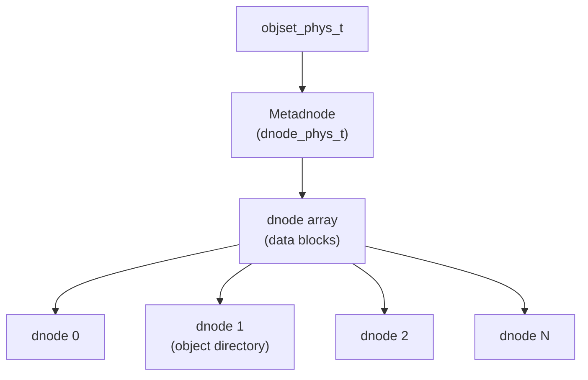

# Chapter 3: Data Management Unit (DMU)

> **Source:** `include/sys/dmu.h`, `include/sys/dnode.h`, `include/sys/dmu_objset.h`, `module/zfs/dmu.c`, `module/zfs/dmu_objset.c`

The Data Management Unit (DMU) consumes blocks (described by block pointers, see [Chapter 2](02-block-pointers.md)) and groups them into logical units called **objects**. Objects are further grouped into **object sets**. The DMU provides the foundation on which all higher layers (DSL, ZAP, ZPL, ZVOL) are built.

## 3.1 Objects

With the exception of the vdev label infrastructure (Chapter 1) and block pointers (Chapter 2), everything in ZFS is an object. Each object has a type that determines how its data is interpreted. See the [glossary](glossary.md#dmu-object-types) for the complete list of object types.

### The Dnode (`dnode_phys_t`)

Objects are described by 512-byte structures called **dnodes**. A dnode organizes the collection of blocks that make up an object. It contains metadata about the object and block pointers to its data.

> **Source:** `include/sys/dnode.h` -- `DNODE_SHIFT = 9` (512 bytes), `DNODE_CORE_SIZE = 64` bytes

```
dnode_phys_t (512 bytes)
Offset  Size      Field               Description
──────  ────      ─────               ───────────────────────────────────
0x00    1 byte    dn_type             Object type (see glossary)
0x01    1 byte    dn_indblkshift      log2(indirect block size in bytes)
0x02    1 byte    dn_nlevels          Number of levels of indirection
0x03    1 byte    dn_nblkptr          Number of block pointers (1-3)
0x04    1 byte    dn_bonustype        Type of data in bonus buffer
0x05    1 byte    dn_checksum         Checksum algorithm for this object
0x06    1 byte    dn_compress         Compression algorithm for this object
0x07    1 byte    dn_flags            Dnode flags
0x08    2 bytes   dn_datablkszsec     Data block size in 512-byte sectors
0x0A    2 bytes   dn_bonuslen         Length of bonus buffer in bytes
0x0C    1 byte    dn_extra_slots      Extra dnode slots consumed (large dnodes)
0x0D    3 bytes   dn_pad              Reserved
0x10    8 bytes   dn_maxblkid         Largest level-0 block ID
0x18    8 bytes   dn_used             Space used (bytes or sectors, see flags)
0x20    32 bytes  dn_pad3             Reserved
0x40    variable  dn_blkptr[N]        Block pointer array (N = dn_nblkptr)
        variable  dn_bonus            Bonus buffer (dn_bonuslen bytes)
──────  ────
        512 bytes total (minimum; large dnodes may be multiples of 512)
```

**Field details:**

- **`dn_type`**: Identifies the object type. A value of `DMU_OT_NONE` (0) indicates a free/unallocated dnode.

- **`dn_indblkshift`** and **`dn_datablkszsec`**: ZFS supports variable block sizes from 512 bytes to 128 KB (and beyond with `large_blocks` feature). `dn_indblkshift` is log2 of the indirect block size. `dn_datablkszsec` is the data block size divided by 512.

- **`dn_nblkptr`** and **`dn_blkptr`**: The dnode contains between 1 and 3 block pointers. This is set at object creation time and remains constant. The block pointer array is at offset 0x40 within the dnode.

- **`dn_nlevels`**: The number of levels of indirection (see below).

- **`dn_maxblkid`**: The largest level-0 (data) block ID for this object. Block IDs are sequential starting from 0.

- **`dn_used`**: Total allocated space for all blocks (data and indirect) of this object. If the `DNODE_FLAG_USED_BYTES` flag is set, this value is in bytes; otherwise it is in multiples of 512 bytes.

- **`dn_bonus`**, **`dn_bonuslen`**, **`dn_bonustype`**: The bonus buffer is the space following the block pointer array within the dnode. It stores inline metadata whose format is determined by `dn_bonustype`. Common bonus buffer types:

| Bonus Type | Structure | Description |
|------------|-----------|-------------|
| `DMU_OT_PACKED_NVLIST_SIZE` | `uint64_t` | Size of a packed nvlist object |
| `DMU_OT_SPACE_MAP_HEADER` | `space_map_obj_t` | Space map header |
| `DMU_OT_DSL_DIR` | `dsl_dir_phys_t` | DSL directory metadata |
| `DMU_OT_DSL_DATASET` | `dsl_dataset_phys_t` | DSL dataset metadata |
| `DMU_OT_ZNODE` | `znode_phys_t` | ZPL file metadata |

### Indirection

A dnode has a limited number of block pointers (1-3). With the maximum data block size of 128 KB and 3 block pointers, the largest object representable without indirection is 384 KB (3 x 128 KB).

To support larger objects, ZFS uses **indirect blocks**. An indirect block is a block filled with block pointers. The number of block pointers per indirect block depends on its size: an indirect block of size `S` holds `S / 128` block pointers (since each `blkptr_t` is 128 bytes). A 128 KB indirect block holds 1024 block pointers.

Levels of indirection are numbered from the bottom:
- **Level 0**: Data blocks (actual file/object data)
- **Level 1**: Indirect blocks containing pointers to level-0 blocks
- **Level 2**: Indirect blocks containing pointers to level-1 blocks
- And so on, up to 6 levels maximum



Given a block ID, ZFS can determine which branch of indirect blocks contains the data block by dividing the block ID by the number of block pointers per indirect block at each level. For example, with 1024 pointers per indirect block, level-0 block ID 16360 maps to level-1 block ID 15 (16360 / 1024 = 15, remainder 1000).

ZFS supports up to 6 levels of indirection, enabling objects up to 2^64 bytes.

## 3.2 Object Sets

The DMU groups related objects into **object sets**. Each object set represents a filesystem, snapshot, clone, or volume. Object sets are described by the `objset_phys_t` structure.

> **Source:** `include/sys/dmu_objset.h`

```
objset_phys_t (1 KB minimum)
Offset  Size       Field             Description
──────  ────       ─────             ───────────────────────────────
0x000   512 bytes  os_meta_dnode     Metadnode (dnode_phys_t)
0x200   variable   os_zil_header     ZIL header (see Chapter 7)
        8 bytes    os_type           Object set type (see below)
        variable   os_pad            Padding
──────  ────
        1024 bytes total (v1)
```

**Object Set Types:**

| Value | Constant | Description |
|-------|----------|-------------|
| 0 | `DMU_OST_NONE` | Uninitialized |
| 1 | `DMU_OST_META` | Meta Object Set (one per pool) |
| 2 | `DMU_OST_ZFS` | ZPL filesystem, snapshot, or clone |
| 3 | `DMU_OST_ZVOL` | ZFS volume |

### The Metadnode

The first member of every object set is the **metadnode** -- a `dnode_phys_t` whose data blocks contain an array of `dnode_phys_t` structures, one for each object in the object set. This metadnode-of-dnodes pattern provides the indexed storage for all objects.

Each object is identified by a 64-bit **object number**, which is the index into the metadnode's dnode array. Object 0 is the metadnode itself. Conventionally, object 1 has a well-known purpose:

- In the MOS (`DMU_OST_META`): Object 1 is the **object directory** (a ZAP object).
- In ZPL object sets (`DMU_OST_ZFS`): Object 1 is the **master node** (a ZAP object).
- In ZVOL object sets (`DMU_OST_ZVOL`): Object 1 is the **ZVOL data** object.


