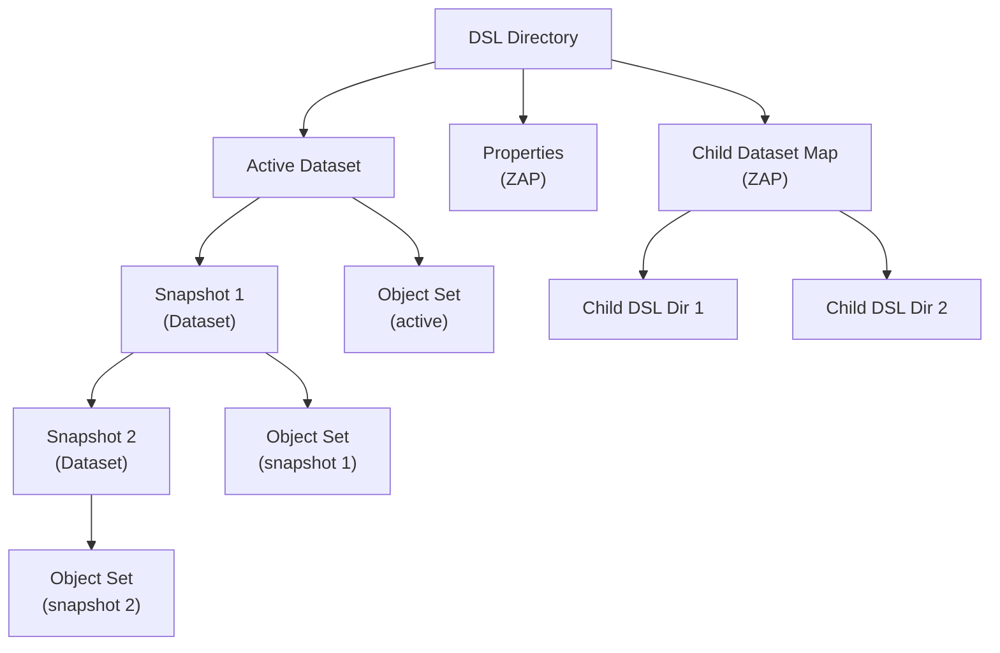

# Chapter 4: Dataset and Snapshot Layer (DSL)

> **Source:** `include/sys/dsl_dataset.h`, `include/sys/dsl_dir.h`, `module/zfs/dsl_dataset.c`, `module/zfs/dsl_dir.c`, `module/zfs/dsl_pool.c`

The DSL (Dataset and Snapshot Layer) manages the relationships between and properties of object sets. It tracks datasets, snapshots, clones, and their interdependencies.

## Object Set Types

ZFS provides four kinds of object sets, all managed by the DSL:

- **Filesystem**: Stores and organizes objects as a POSIX-compliant filesystem.
- **Clone**: A writable copy of a snapshot. Initially identical to the snapshot it originated from.
- **Snapshot**: A read-only, point-in-time image of a filesystem, clone, or volume.
- **Volume**: A logical block device exported by ZFS.

### Relationships

The DSL tracks these interdependencies:

- **Clones** reference the snapshot from which they were created. That snapshot cannot be destroyed until all its clones are destroyed.
- **Snapshots** form a linked list from the most recent back to the oldest. A filesystem/clone/volume cannot be destroyed without first destroying its snapshots.
- **Children**: Datasets can be hierarchically nested. A parent cannot be destroyed without first destroying all children.

## 4.1 DSL Infrastructure

Each object set is represented as a **dataset**. A dataset manages space consumption statistics, contains a block pointer to the object set data, and tracks snapshot dependencies.

Datasets are organized into **DSL directories**. A DSL directory groups a set of related datasets and manages their shared properties. Each DSL directory has exactly one **active dataset** (the live filesystem/volume). All other datasets under the directory are snapshots related to the active dataset.

## 4.2 DSL Implementation

The DSL is implemented as an object set of type `DMU_OST_META` -- the **Meta Object Set** (MOS). There is exactly one MOS per pool, and the uberblock's `ub_rootbp` points to it.

The MOS has a distinguished object at index 1: the **object directory**. This is a ZAP object containing name-value pairs that serve as the root for all pool metadata. See [Section 4.6](#46-mos-object-directory) for the complete list of entries.

The three original entries are:

| Attribute | Type | Description |
|-----------|------|-------------|
| `root_dataset` | `uint64` | Object number of the root DSL directory |
| `config` | `uint64` | Object number of a packed nvlist with vdev configuration |
| `sync_bplist` | `uint64` | Object number of block pointers to free in next txg |

The `root_dataset` DSL directory is the parent of all top-level datasets in the pool.

## 4.3 Dataset Internals (`dsl_dataset_phys_t`)

Datasets are stored as objects of type `DMU_OT_DSL_DATASET`. The dataset metadata is stored in the dnode's bonus buffer as a `dsl_dataset_phys_t` structure.

> **Source:** `include/sys/dsl_dataset.h`

| Field | Type | Description |
|-------|------|-------------|
| `ds_dir_obj` | `uint64` | Object number of the parent DSL directory |
| `ds_prev_snap_obj` | `uint64` | Previous snapshot's dataset object (0 if none) |
| `ds_prev_snap_txg` | `uint64` | TXG when previous snapshot was taken |
| `ds_next_snap_obj` | `uint64` | Next snapshot's dataset object (0 for active datasets) |
| `ds_snapnames_zapobj` | `uint64` | ZAP object mapping snapshot names to dataset object numbers |
| `ds_num_children` | `uint64` | Number of references to this snapshot (0 for non-snapshots) |
| `ds_creation_time` | `uint64` | UTC seconds since epoch |
| `ds_creation_txg` | `uint64` | Transaction group of creation |
| `ds_deadlist_obj` | `uint64` | Object containing block pointers deleted since last snapshot |
| `ds_referenced_bytes` | `uint64` | Total bytes referenced by this dataset (including shared) |
| `ds_compressed_bytes` | `uint64` | Compressed bytes in this dataset |
| `ds_uncompressed_bytes` | `uint64` | Uncompressed bytes in this dataset |
| `ds_unique_bytes` | `uint64` | Bytes unique to this snapshot (0 for active datasets) |
| `ds_fsid_guid` | `uint64` | 56-bit ID that may change to avoid collisions |
| `ds_guid` | `uint64` | 64-bit permanent globally unique ID |
| `ds_flags` | `uint64` | Dataset flags (see below) |
| `ds_bp` | `blkptr_t` | Block pointer to this dataset's object set |
| `ds_next_clones_obj` | `uint64` | ZAP tracking clones of this snapshot (v11+) |
| `ds_props_obj` | `uint64` | ZAP for snapshot properties (v12+) |
| `ds_userrefs_obj` | `uint64` | ZAP for user reference holds (v18+) |
| `ds_pad[5]` | `uint64[5]` | Reserved (total structure: 320 bytes) |

**Dataset flags (`ds_flags`):**

| Bit | Flag | Description |
|-----|------|-------------|
| 0 | `DS_FLAG_INCONSISTENT` | Dataset is in an inconsistent state (e.g., mid-receive) |
| 1 | `DS_FLAG_NOPROMOTE` | Do not allow clone promotion |
| 2 | `DS_FLAG_UNIQUE_ACCURATE` | `ds_unique_bytes` is accurately calculated (v9+) |
| 3 | `DS_FLAG_DEFER_DESTROY` | Deferred destroy via `zfs destroy -d` (v18+) |
| 16 | `DS_FLAG_CI_DATASET` | Case-insensitive name lookups |

**Snapshot chain:** For an active dataset, `ds_prev_snap_obj` points to the most recent snapshot. Each snapshot's `ds_prev_snap_obj` points to the previous snapshot, forming a singly-linked list back through time. `ds_next_snap_obj` links in the forward direction (from older to newer snapshots).

**`ds_num_children`**: For snapshots, this counts the number of references: one from the next snapshot (or active dataset) plus one for each clone created from this snapshot. This reference count prevents deletion of a snapshot that still has dependents.

**`ds_unique_bytes`**: Tracks how much data is unique to a snapshot -- data that has been overwritten or deleted in the active dataset since the snapshot was taken.

**`ds_next_clones_obj`**: A ZAP object (`DMU_OT_DSL_CLONES`) mapping clone names to their DSL directory object numbers. Added in pool version 11 to efficiently enumerate all clones of a snapshot.

**`ds_props_obj`**: A ZAP object storing properties specific to snapshots. Before pool version 12, snapshots could not have properties.

**`ds_userrefs_obj`**: A ZAP object (`DMU_OT_USERREFS`) mapping user hold tags to their creation timestamps. User holds (via `zfs hold`) prevent snapshot destruction.

## 4.4 DSL Directory Internals (`dsl_dir_phys_t`)

DSL directories are stored as objects of type `DMU_OT_DSL_DIR`. The metadata is stored in the dnode's bonus buffer as a `dsl_dir_phys_t` structure.

> **Source:** `include/sys/dsl_dir.h`

| Field | Type | Description |
|-------|------|-------------|
| `dd_creation_time` | `uint64` | UTC seconds since epoch (not actually used) |
| `dd_head_dataset_obj` | `uint64` | Object number of the active dataset |
| `dd_parent_obj` | `uint64` | Object number of the parent DSL directory |
| `dd_origin_obj` | `uint64` | For clones: object number of the origin snapshot's dataset |
| `dd_child_dir_zapobj` | `uint64` | ZAP object mapping child names to DSL directory object numbers |
| `dd_used_bytes` | `uint64` | Bytes used by all datasets in this directory (including snapshots and children) |
| `dd_compressed_bytes` | `uint64` | Compressed bytes for all datasets |
| `dd_uncompressed_bytes` | `uint64` | Uncompressed bytes for all datasets |
| `dd_quota` | `uint64` | Quota in bytes (0 = no quota) |
| `dd_reserved` | `uint64` | Reserved space in bytes |
| `dd_props_zapobj` | `uint64` | ZAP object containing dataset properties |
| `dd_deleg_zapobj` | `uint64` | ZAP for delegation permissions (v8+) |
| `dd_flags` | `uint64` | Directory flags (see below) |
| `dd_used_breakdown[5]` | `uint64[5]` | Space usage breakdown (v13+, see below) |
| `dd_clones` | `uint64` | ZAP tracking clones of this directory's origin (v26+) |
| `dd_pad[13]` | `uint64[13]` | Reserved (total structure: 256 bytes) |

**Directory flags (`dd_flags`):**

| Bit | Flag | Description |
|-----|------|-------------|
| 0 | `DD_FLAG_USED_BREAKDOWN` | `dd_used_breakdown` array is valid |

**Space usage breakdown (`dd_used_breakdown`):**

When `DD_FLAG_USED_BREAKDOWN` is set, the `dd_used_bytes` total is decomposed into five categories:

| Index | Constant | Description |
|-------|----------|-------------|
| 0 | `DD_USED_HEAD` | Space used by the active (head) dataset |
| 1 | `DD_USED_SNAP` | Space used by snapshots |
| 2 | `DD_USED_CHILD` | Space used by child datasets |
| 3 | `DD_USED_CHILD_RSRV` | Space reserved by children |
| 4 | `DD_USED_REFRSRV` | Space consumed by `refreservation` |

### Dataset Properties

The `dd_props_zapobj` ZAP object stores locally-set property values. Only non-inherited (explicitly set) values are stored; default and inherited values are inferred from the absence of an entry.

Common properties and their values:

| Property | Description | Values |
|----------|-------------|--------|
| `atime` | Update access time on read | 0=off, 1=on (default) |
| `checksum` | Checksum algorithm | 1=on (default), 2=off |
| `compression` | Compression algorithm | 1=on, 2=off (default) |
| `mountpoint` | Filesystem mount point | string |
| `quota` | Space limit in bytes | bytes or 0 (no quota) |
| `refquota` | Quota excluding snapshots/children (v9+) | bytes |
| `recordsize` | Block size for file data | bytes (default 128K) |
| `reservation` | Reserved space in bytes | bytes |
| `refreservation` | Reservation for referenced data only (v9+) | bytes |
| `readonly` | Prevent modifications | 0=readwrite (default), 1=readonly |
| `dnodesize` | Dnode size for new objects | `legacy`, `auto`, `1k`-`16k` |
| `encryption` | Encryption algorithm | `off`, `aes-256-ccm`, `aes-256-gcm` |
| `xattr` | Extended attribute handling | `off`, `dir` (default), `sa` |
| `special_small_blocks` | Threshold for special vdev | bytes (0 = disabled) |

## 4.5 Extensible Dataset Fields

> **Source:** `include/sys/dsl_dataset.h`, `include/sys/dsl_dir.h` -- feature `com.delphix:extensible_dataset`

With the `extensible_dataset` feature, datasets and DSL directories can store additional metadata as key-value pairs in their own ZAP objects, avoiding the need to expand the fixed `dsl_dataset_phys_t` or `dsl_dir_phys_t` structures.

**Dataset ZAP fields (`DS_FIELD_*`):**

| Key | Description | Feature |
|-----|-------------|---------|
| `com.delphix:bookmarks` | Object number of bookmarks ZAP | `feature@bookmarks` |
| `org.zfsonlinux:large_dnode` | Present if dataset has large dnodes | `feature@large_dnode` |
| `com.delphix:remap_deadlist` | Object number of remap deadlist | `feature@obsolete_counts` |
| `com.datto:ivset_guid` | IV set GUID for encrypted snapshots | `feature@encryption` |
| `com.delphix:resume_fromguid` | Source GUID for resumable receive | `feature@extensible_dataset` |
| `com.delphix:resume_toname` | Target dataset name | `feature@extensible_dataset` |
| `com.delphix:resume_toguid` | Target GUID | `feature@extensible_dataset` |
| `com.delphix:resume_object` | Last received object number | `feature@extensible_dataset` |
| `com.delphix:resume_offset` | Last received offset | `feature@extensible_dataset` |
| `com.delphix:resume_bytes` | Bytes received so far | `feature@extensible_dataset` |
| `com.delphix:resume_largeblockok` | Resumable receive: large blocks were allowed | `feature@extensible_dataset` |
| `com.delphix:resume_embedok` | Resumable receive: embedded blocks were allowed | `feature@extensible_dataset` |
| `com.delphix:resume_compressok` | Resumable receive: compressed blocks were allowed | `feature@extensible_dataset` |
| `com.datto:resume_rawok` | Resumable receive: raw (encrypted) send was allowed | `feature@extensible_dataset` |
| `com.delphix:resume_redact_book_snaps` | Redaction bookmark snapshot GUID list | `feature@extensible_dataset` |

**DSL directory ZAP fields (`DD_FIELD_*`):**

| Key | Description | Feature |
|-----|-------------|---------|
| `com.joyent:filesystem_count` | Number of child filesystems | `feature@filesystem_limits` |
| `com.joyent:snapshot_count` | Number of snapshots | `feature@filesystem_limits` |
| `com.datto:crypto_key_obj` | Encryption key object number | `feature@encryption` |
| `com.delphix:livelist` | Livelist object number | `feature@livelist` |
| `com.ixsystems:snapshots_changed` | Snapshot namespace change tracking | — |

## 4.6 MOS Object Directory

> **Source:** `include/sys/dmu.h`

The MOS object directory (object 1 in the Meta Object Set) is a ZAP object containing name-value pairs that serve as the root of all pool metadata. The following entries may be present:

| Attribute | Description |
|-----------|-------------|
| `root_dataset` | Object number of the root DSL directory |
| `config` | Packed nvlist with pool/vdev configuration |
| `sync_bplist` | Block pointers to free in next txg |
| `free_bpobj` | Free block pointer object |
| `history` | Pool command history |
| `pool_props` | Pool-level properties (ZAP) |
| `errlog_scrub` | Error log from last scrub |
| `errlog_last` | Error log from last operation |
| `error_scrub` | Scrub error counters |
| `last_scrubbed_txg` | TXG of last completed scrub |
| `spares` | Spare vdev configuration |
| `l2cache` | L2ARC cache device configuration |
| `features_for_read` | ZAP of features required to read the pool |
| `features_for_write` | ZAP of features required to write the pool |
| `feature_descriptions` | ZAP of human-readable feature descriptions |
| `feature_enabled_txg` | ZAP mapping features to the txg they were enabled |
| `creation_version` | Pool version at creation time |
| `scan` | Scrub/resilver scan state |
| `DDT-%s-%s-%s` | Dedup table (keyed by checksum, type, class) |
| `DDT-log-%s-%u` | Dedup log (per checksum class) |
| `DDT-statistics` | Dedup statistics |
| `DDT-%s` | DDT directory (per checksum class) |
| `deflate` | Metaslabs deflated (pre-v17 pools) |
| `tmp_userrefs` | Temporary snapshot references |
| `bptree_obj` | Block pointer tree for async destroy |
| `empty_bpobj` | Shared empty block pointer object |
| `org.illumos:checksum_salt` | Per-pool checksum salt |
| `com.delphix:vdev_zap_map` | Maps vdev IDs to per-vdev ZAP objects |
| `com.delphix:removing` | Device removal state |
| `com.delphix:obsolete_bpobj` | Obsolete block pointers (device removal) |
| `com.delphix:condensing_indirect` | Indirect vdev condensing state |
| `com.delphix:zpool_checkpoint` | Pool checkpoint state |
| `com.delphix:log_spacemap_zap` | Log spacemap ZAP |
| `com.delphix:deleted_clones` | Pending deleted clones |
| `com.klarasystems:txg_log_time:minutes` | TXG log time (minutes) |
| `com.klarasystems:txg_log_time:days` | TXG log time (days) |
| `com.klarasystems:txg_log_time:months` | TXG log time (months) |

## 4.7 Bookmarks

> **Source:** `include/sys/dsl_bookmark.h` -- feature `com.delphix:bookmarks`

A **bookmark** is a lightweight reference to a point in a dataset's transaction history. Unlike snapshots, bookmarks do not hold data blocks — they only record the txg and GUID needed for incremental `zfs send`.

Bookmarks are stored in a ZAP object pointed to by the `com.delphix:bookmarks` extensible dataset field. Each bookmark entry maps a name to a `zfs_bookmark_phys_t` value:

| Field | Type | Description |
|-------|------|-------------|
| `zbm_guid` | `uint64` | GUID of the bookmarked dataset |
| `zbm_creation_txg` | `uint64` | Transaction group of the bookmark |
| `zbm_creation_time` | `uint64` | Creation time (UTC seconds since epoch) |

The structure above is the V1 bookmark (24 bytes). The `bookmark_v2` feature extends it to 96 bytes with additional fields:

| Field | Type | Description |
|-------|------|-------------|
| `zbm_redaction_obj` | `uint64` | Redaction list object (redacted send) |
| `zbm_flags` | `uint64` | Flags (see below) |
| `zbm_referenced_bytes_refd` | `uint64` | Referenced bytes at bookmark point |
| `zbm_compressed_bytes_refd` | `uint64` | Compressed bytes at bookmark point |
| `zbm_uncompressed_bytes_refd` | `uint64` | Uncompressed bytes at bookmark point |
| `zbm_referenced_freed_before_next_snap` | `uint64` | Referenced bytes freed before next snapshot |
| `zbm_compressed_freed_before_next_snap` | `uint64` | Compressed bytes freed |
| `zbm_uncompressed_freed_before_next_snap` | `uint64` | Uncompressed bytes freed |
| `zbm_ivset_guid` | `uint64` | IV set GUID (encrypted datasets) |

**Bookmark flags:**

| Bit | Flag | Description |
|-----|------|-------------|
| 0 | `ZBM_FLAG_HAS_FBN` | Has "freed before next" size fields |
| 1 | `ZBM_FLAG_SNAPSHOT_EXISTS` | The bookmarked snapshot still exists |

The `bookmark_written` feature enables the `written#<bookmark>` property, which reports how much data has been written since the bookmark point. The freed-before-next-snap fields enable accurate `zfs send` size estimation.

## 4.8 Deadlists

> **Source:** `include/sys/dsl_deadlist.h`

A **deadlist** tracks block pointers that were freed since the previous snapshot. When a block is overwritten or deleted, the old block pointer is added to the active dataset's deadlist. When a snapshot is destroyed, its deadlist is merged with adjacent snapshots.

The deadlist header is stored as a `dsl_deadlist_phys_t` in the dnode bonus buffer:

| Field | Type | Description |
|-------|------|-------------|
| `dl_used` | `uint64` | Total referenced bytes in the deadlist |
| `dl_comp` | `uint64` | Total compressed bytes |
| `dl_uncomp` | `uint64` | Total uncompressed bytes |
| `dl_pad[37]` | `uint64[37]` | Reserved (total: 320 bytes) |

The deadlist's data blocks contain a ZAP object that maps minimum transaction group numbers (`mintxg`) to block pointer object (`bpobj`) numbers. Each bpobj accumulates the block pointers freed during that txg range. This tree structure (introduced in pool version 26) replaced the earlier flat bpobj list, improving snapshot deletion performance.

## 4.9 Livelists

> **Source:** `include/sys/dsl_deadlist.h` -- feature `com.delphix:livelist`

A **livelist** is the inverse of a deadlist: it tracks blocks that are unique to a clone (allocated after the clone was created). When a clone is destroyed, the livelist allows ZFS to free only the clone-specific blocks without walking the entire dataset, significantly improving clone deletion performance.

Livelists are stored as a ZAP object pointed to by the `com.delphix:livelist` extensible directory field. They use the same `dsl_deadlist_phys_t` structure as deadlists.
