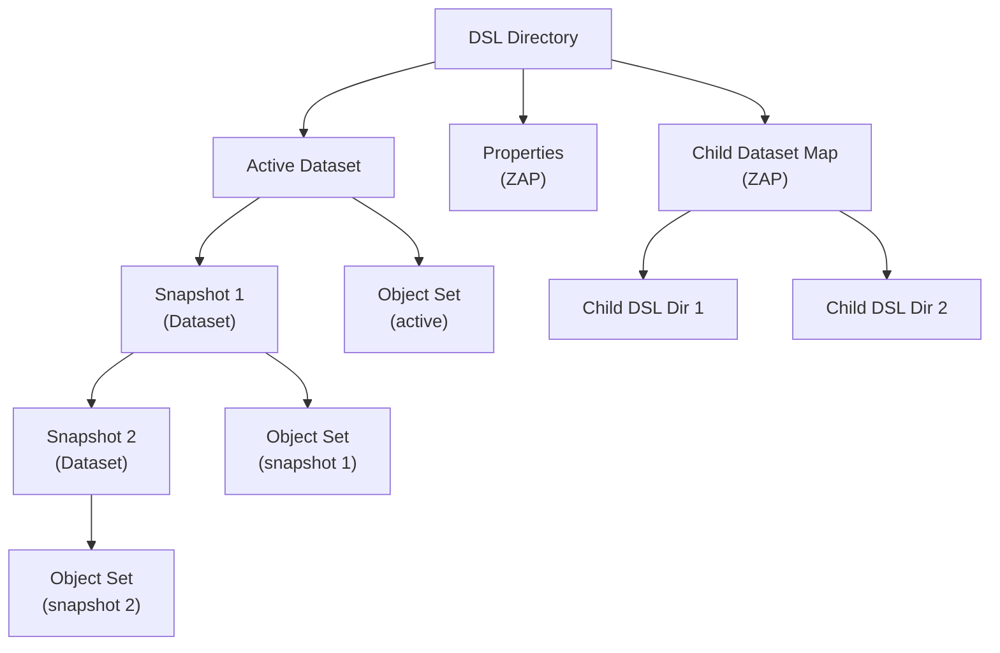

# Chapter 4: Dataset and Snapshot Layer (DSL)

> **Source:** `include/sys/dsl_dataset.h`, `include/sys/dsl_dir.h`, `module/zfs/dsl_dataset.c`, `module/zfs/dsl_dir.c`, `module/zfs/dsl_pool.c`

The DSL (Dataset and Snapshot Layer) manages the relationships between and properties of object sets. It tracks datasets, snapshots, clones, and their interdependencies.

## Object Set Types

ZFS provides four kinds of object sets, all managed by the DSL:

- **Filesystem**: Stores and organizes objects as a POSIX-compliant filesystem.
- **Clone**: A writable copy of a snapshot. Initially identical to the snapshot it originated from.
- **Snapshot**: A read-only, point-in-time image of a filesystem, clone, or volume.
- **Volume**: A logical block device exported by ZFS.

### Relationships

The DSL tracks these interdependencies:

- **Clones** reference the snapshot from which they were created. That snapshot cannot be destroyed until all its clones are destroyed.
- **Snapshots** form a linked list from the most recent back to the oldest. A filesystem/clone/volume cannot be destroyed without first destroying its snapshots.
- **Children**: Datasets can be hierarchically nested. A parent cannot be destroyed without first destroying all children.

## 4.1 DSL Infrastructure

Each object set is represented as a **dataset**. A dataset manages space consumption statistics, contains a block pointer to the object set data, and tracks snapshot dependencies.

Datasets are organized into **DSL directories**. A DSL directory groups a set of related datasets and manages their shared properties. Each DSL directory has exactly one **active dataset** (the live filesystem/volume). All other datasets under the directory are snapshots related to the active dataset.

## 4.2 DSL Implementation

The DSL is implemented as an object set of type `DMU_OST_META` -- the **Meta Object Set** (MOS). There is exactly one MOS per pool, and the uberblock's `ub_rootbp` points to it.

The MOS has a distinguished object at index 1: the **object directory**. This is a ZAP object containing name-value pairs that serve as the root for all pool metadata:

| Attribute | Type | Description |
|-----------|------|-------------|
| `root_dataset` | `uint64` | Object number of the root DSL directory |
| `config` | `uint64` | Object number of a packed nvlist with vdev configuration |
| `sync_bplist` | `uint64` | Object number of block pointers to free in next txg |

The `root_dataset` DSL directory is the parent of all top-level datasets in the pool.

## 4.3 Dataset Internals (`dsl_dataset_phys_t`)

Datasets are stored as objects of type `DMU_OT_DSL_DATASET`. The dataset metadata is stored in the dnode's bonus buffer as a `dsl_dataset_phys_t` structure.

> **Source:** `include/sys/dsl_dataset.h`

| Field | Type | Description |
|-------|------|-------------|
| `ds_dir_obj` | `uint64` | Object number of the parent DSL directory |
| `ds_prev_snap_obj` | `uint64` | Previous snapshot's dataset object (0 if none) |
| `ds_prev_snap_txg` | `uint64` | TXG when previous snapshot was taken |
| `ds_next_snap_obj` | `uint64` | Next snapshot's dataset object (0 for active datasets) |
| `ds_snapnames_zapobj` | `uint64` | ZAP object mapping snapshot names to dataset object numbers |
| `ds_num_children` | `uint64` | Number of references to this snapshot (0 for non-snapshots) |
| `ds_creation_time` | `uint64` | UTC seconds since epoch |
| `ds_creation_txg` | `uint64` | Transaction group of creation |
| `ds_deadlist_obj` | `uint64` | Object containing block pointers deleted since last snapshot |
| `ds_used_bytes` | `uint64` | Unique bytes used by this dataset's object set |
| `ds_compressed_bytes` | `uint64` | Compressed bytes in this dataset |
| `ds_uncompressed_bytes` | `uint64` | Uncompressed bytes in this dataset |
| `ds_unique_bytes` | `uint64` | Bytes unique to this snapshot (0 for active datasets) |
| `ds_fsid_guid` | `uint64` | Per-open unique ID (may change between opens) |
| `ds_guid` | `uint64` | Permanent globally unique ID |
| `ds_flags` | `uint64` | Dataset flags (e.g., restoring in progress) |
| `ds_bp` | `blkptr_t` | Block pointer to this dataset's object set |

**Snapshot chain:** For an active dataset, `ds_prev_snap_obj` points to the most recent snapshot. Each snapshot's `ds_prev_snap_obj` points to the previous snapshot, forming a singly-linked list back through time. `ds_next_snap_obj` links in the forward direction (from older to newer snapshots).

**`ds_num_children`**: For snapshots, this counts the number of references: one from the next snapshot (or active dataset) plus one for each clone created from this snapshot. This reference count prevents deletion of a snapshot that still has dependents.

**`ds_unique_bytes`**: Tracks how much data is unique to a snapshot -- data that has been overwritten or deleted in the active dataset since the snapshot was taken.

## 4.4 DSL Directory Internals (`dsl_dir_phys_t`)

DSL directories are stored as objects of type `DMU_OT_DSL_DIR`. The metadata is stored in the dnode's bonus buffer as a `dsl_dir_phys_t` structure.

> **Source:** `include/sys/dsl_dir.h`

| Field | Type | Description |
|-------|------|-------------|
| `dd_creation_time` | `uint64` | UTC seconds since epoch |
| `dd_head_dataset_obj` | `uint64` | Object number of the active dataset |
| `dd_parent_obj` | `uint64` | Object number of the parent DSL directory |
| `dd_origin_obj` | `uint64` | For clones: object number of the origin snapshot |
| `dd_child_dir_zapobj` | `uint64` | ZAP object mapping child names to DSL directory object numbers |
| `dd_used_bytes` | `uint64` | Bytes used by all datasets in this directory (including snapshots and children) |
| `dd_compressed_bytes` | `uint64` | Compressed bytes for all datasets |
| `dd_uncompressed_bytes` | `uint64` | Uncompressed bytes for all datasets |
| `dd_quota` | `uint64` | Quota in bytes (0 = no quota) |
| `dd_reserved` | `uint64` | Reserved space in bytes |
| `dd_props_zapobj` | `uint64` | ZAP object containing dataset properties |

### Dataset Properties

The `dd_props_zapobj` ZAP object stores locally-set property values. Only non-inherited (explicitly set) values are stored; default and inherited values are inferred from the absence of an entry.

Common properties and their values:

| Property | Description | Values |
|----------|-------------|--------|
| `atime` | Update access time on read | 0=off, 1=on (default) |
| `checksum` | Checksum algorithm | 1=on (default), 2=off |
| `compression` | Compression algorithm | 1=on, 2=off (default) |
| `mountpoint` | Filesystem mount point | string |
| `quota` | Space limit in bytes | bytes or 0 (no quota) |
| `recordsize` | Block size for file data | bytes (default 128K) |
| `reservation` | Reserved space in bytes | bytes |
| `readonly` | Prevent modifications | 0=readwrite (default), 1=readonly |
| `exec` | Allow executing files | 0=noexec, 1=exec (default) |
| `setuid` | Honor set-UID bit | 0=nosetuid, 1=setuid (default) |
| `sharenfs` | NFS share options | string |
| `snapdir` | Visibility of .zfs directory | 0=hidden, 1=visible (default) |
| `volblocksize` | Volume block size | 512 to 128K (default 8K) |
| `volsize` | Volume size in bytes | bytes |
