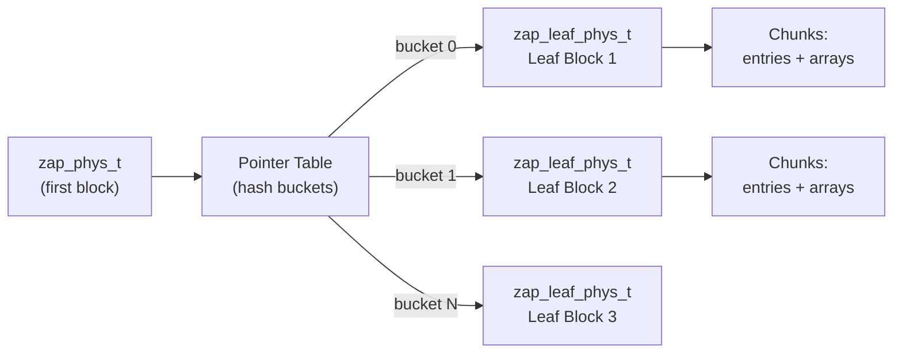

# Chapter 5: ZFS Attribute Processor (ZAP)

> **Source:** `include/sys/zap.h`, `include/sys/zap_impl.h`, `include/sys/zap_leaf.h`, `module/zfs/zap.c`, `module/zfs/zap_micro.c`, `module/zfs/zap_leaf.c`

The ZAP (ZFS Attribute Processor) is a module built on top of the DMU that provides name-value pair storage in objects called **ZAP objects**. ZAP objects are the backbone of ZFS metadata: they store directory entries, dataset properties, pool configuration, and more.

**Attribute format:**
- **Name**: A zero-terminated string of up to `ZAP_MAXNAMELEN` bytes (256, including the null).
  For directory ZAPs, `feature@longname` (`org.zfsonlinux:longname`) allows names up to `ZAP_MAXNAMELEN_NEW` (1024).
  Some ZAPs use **binary keys** (`ZAP_FLAG_UINT64_KEY`), in which case the “name” is an array of 64‑bit integers.
- **Value**: An array of integers sized 1, 2, 4, or 8 bytes. The total size is limited by `ZAP_MAXVALUELEN` (8192 bytes).
- **Zero-length values** are allowed and can be used as presence flags.

ZAP objects are used for many DMU object types:

| Object Type | Usage |
|-------------|-------|
| `DMU_OT_OBJECT_DIRECTORY` | MOS object directory |
| `DMU_OT_DSL_DIR_CHILD_MAP` | DSL child directory entries |
| `DMU_OT_DSL_DS_SNAP_MAP` | Dataset snapshot name mappings |
| `DMU_OT_DSL_PROPS` | Dataset properties |
| `DMU_OT_DIRECTORY_CONTENTS` | ZPL directory entries |
| `DMU_OT_MASTER_NODE` | ZPL master node |
| `DMU_OT_UNLINKED_SET` | Delete queue |
| `DMU_OT_ZVOL_PROP` | ZVOL properties |

This list is representative, not exhaustive; ZAP objects are used widely across MOS and DSL metadata.

## ZAP Object Forms

ZAP objects come in two forms:

- **Microzap**: A lightweight format optimized for a small number of simple attributes.
- **Fat ZAP** (fatzap): A flexible, hash-based format for large numbers of attributes or complex values.

### Selection Criteria

A microzap is used when **all** of the following conditions are met:

1. All name-value entries fit in a single data block no larger than the microzap size limit.
   By default this is `SPA_OLD_MAXBLOCKSIZE` (128 KB), but it can grow up to 1 MB if
   `feature@large_microzap` (`com.klarasystems:large_microzap`) is enabled and
   `feature@large_blocks` permits larger blocks.
2. All values are a single `uint64_t` (integer size 8, count 1).
3. All names are `MZAP_NAME_LEN` bytes or fewer (50, including null terminator).

If any condition is not met, a fat ZAP is used instead.

### Block Type Identifiers

The first 64-bit word of each ZAP block identifies its type:

| Identifier | Value | Description |
|------------|-------|-------------|
| `ZBT_MICRO` | `(1ULL << 63) + 3` | Microzap block |
| `ZBT_HEADER` | `(1ULL << 63) + 1` | Fat ZAP header (first block only) |
| `ZBT_LEAF` | `(1ULL << 63) + 0` | Fat ZAP leaf block |

Any other value denotes an external pointer table block.

## 5.1 Microzap

The microzap stores attributes in a single block as a flat array of fixed-size entries.

### Block Layout

```
Microzap Block (one block)
+────────────────────────────────────────────────+
| mzap_phys_t header (64 bytes)                  |
|   uint64_t  mz_block_type  = ZBT_MICRO         |
|   uint64_t  mz_salt        (hash salt)          |
|   uint64_t  mz_normflags   (name normalization) |
|   uint64_t  mz_pad[5]      (reserved)           |
| mzap_ent_phys_t mz_chunk[0] (first entry)      |
+────────────────────────────────────────────────+
| mzap_ent_phys_t array (remainder of block)     |
|   ...                                          |
+────────────────────────────────────────────────+
```

The first 64 bytes form the header. The first entry begins at offset 64, and the remaining bytes are filled with additional `mzap_ent_phys_t` entries.

### Microzap Entry (`mzap_ent_phys_t`)

Each entry is exactly 64 bytes:

```
mzap_ent_phys_t (64 bytes)
Offset  Size      Field         Description
──────  ────      ─────         ──────────────────────────────────
0x00    8 bytes   mze_value     The uint64_t value
0x08    4 bytes   mze_cd        Collision differentiator
0x0C    2 bytes   mze_pad       Reserved
0x0E    50 bytes  mze_name      Null-terminated attribute name
──────  ────
        64 bytes  total
```

- **`mze_value`**: The attribute's 64-bit integer value.
- **`mze_cd`**: Collision differentiator assigned when multiple names hash to the same value. The lowest unused CD is assigned.
- **`mze_name`**: The attribute name, null-terminated, up to 50 bytes (including the null).

## 5.2 Fat ZAP

The fat ZAP uses a hash-based architecture for storing larger numbers of attributes and/or attributes with long names or non-`uint64_t` values.

### Architecture Overview



All entries are indexed by a salted CRC64 hash of the attribute name.
By default ZAP uses **28 hash bits**; with `ZAP_FLAG_HASH64` it uses **48 bits**.
The ZAP uses **extendible hashing**: a pointer table maps high-order hash bits to leaf blocks, and leaves may split as they fill, increasing the prefix length and possibly growing the pointer table.

### 5.2.1 `zap_phys_t` (Header Block)

The first block of a fat ZAP object contains the header. The block size is the ZAP object's data block size (commonly 16 KB, and larger when `large_blocks` is enabled):

| Field | Type | Description |
|-------|------|-------------|
| `zap_block_type` | `uint64` | Always `ZBT_HEADER` |
| `zap_magic` | `uint64` | `0x2F52AB2AB` ("zfs-zap-zap") |
| `zap_ptrtbl.zt_blk` | `uint64` | Block ID of external pointer table (0 if embedded) |
| `zap_ptrtbl.zt_numblks` | `uint64` | Number of blocks in external pointer table |
| `zap_ptrtbl.zt_shift` | `uint64` | Number of hash bits used to index the pointer table |
| `zap_ptrtbl.zt_nextblk` | `uint64` | Used during pointer table resize |
| `zap_ptrtbl.zt_blks_copied` | `uint64` | Used during pointer table resize |
| `zap_freeblk` | `uint64` | Next available block for new leaf allocation |
| `zap_num_leafs` | `uint64` | Number of leaf blocks |
| `zap_num_entries` | `uint64` | Total number of attributes stored |
| `zap_salt` | `uint64` | Salt stirred into the hash function |
| `zap_normflags` | `uint64` | Name normalization flags (u8_textprep) |
| `zap_flags` | `uint64` | ZAP flags (hash64, uint64 keys, pre-hashed keys) |

The pointer table may be embedded in the **second half** of the header block.
The embedded table has `block_size / 16` entries (e.g., 16K → 1024 entries, 128K → 8192 entries).
If `zt_shift` exceeds the embedded capacity, the table is stored externally in separate blocks referenced by `zt_blk`.

### 5.2.2 Pointer Table

The pointer table maps a hash **prefix** to a leaf block. The prefix is the `zt_shift` high‑order bits of the 64‑bit hash. Multiple pointer table entries may reference the same leaf (when a leaf’s prefix is shorter than `zt_shift`), which is how extendible hashing represents ranges of prefixes.

### 5.2.3 Leaf Blocks (`zap_leaf_phys_t`)

Leaf blocks hold the actual attribute data. When a leaf fills, it is **split**: the prefix length is increased and a new leaf is created, and the pointer table is updated to reference the two leaves. There is no on‑disk “next leaf” pointer; the pointer table defines which leaf owns each prefix.

Each leaf block contains:

1. **Header** (`zap_leaf_header`): 48 bytes (2 chunk-sized slots)
2. **Hash table** (`l_hash`): `block_size / 32` entries of 16‑bit chunk indices
3. **Chunk array** (`l_chunk`): Array of 24‑byte chunks

**Leaf Header Fields:**

| Field | Type | Description |
|-------|------|-------------|
| `lh_block_type` | `uint64` | Always `ZBT_LEAF` |
| `lh_pad1` | `uint64` | Reserved |
| `lh_prefix` | `uint64` | Hash prefix for entries in this leaf |
| `lh_magic` | `uint32` | Leaf magic: `0x2AB1EAF` ("zap-leaf") |
| `lh_nfree` | `uint16` | Number of free chunks |
| `lh_nentries` | `uint16` | Number of attribute entries |
| `lh_prefix_len` | `uint16` | Number of bits in the prefix |
| `lh_freelist` | `uint16` | Index of first free chunk |
| `lh_flags` | `uint8` | Leaf flags (e.g., CD-sorted entries) |
| `lh_pad2[11]` | `uint8[11]` | Reserved |

**Leaf Hash Table:** `block_size / 32` entries of 16‑bit integers, each indexing into the chunk array.
The bucket index uses the next `ZAP_LEAF_HASH_SHIFT` bits of the hash after the prefix (e.g., 512 buckets for 16K leaves, 4096 buckets for 128K leaves).

### 5.2.4 Chunks (`zap_leaf_chunk`)

Each chunk is 24 bytes. Chunks come in three types, distinguished by their first byte:

#### Entry Chunk (`zap_leaf_entry`, type = 252)

```
Offset  Size     Field            Description
──────  ────     ─────            ──────────────────────────────
0x00    1 byte   le_type          252 (ZAP_LEAF_ENTRY)
0x01    1 byte   le_value_intlen  Size of value integers in bytes
0x02    2 bytes  le_next          Next entry in hash chain (0xFFFF = end)
0x04    2 bytes  le_name_chunk    Index of first array chunk holding the name
0x06    2 bytes  le_name_numints  Number of integers in name (incl. null)
0x08    2 bytes  le_value_chunk   Index of first array chunk holding the value
0x0A    2 bytes  le_value_numints Number of value integers
0x0C    4 bytes  le_cd            Collision differentiator
0x10    8 bytes  le_hash          64-bit hash of the attribute name
──────  ────
        24 bytes total
```

#### Array Chunk (`zap_leaf_array`, type = 251)

```
Offset  Size     Field         Description
──────  ────     ─────         ──────────────────────────
0x00    1 byte   la_type       251 (ZAP_LEAF_ARRAY)
0x01    21 bytes la_array      Name or value data
0x16    2 bytes  la_next       Next array chunk (0xFFFF = end)
──────  ────
        24 bytes total
```

Array chunks hold the actual name and value bytes. They are chained together for names or values longer than 21 bytes.
Integer arrays (names for uint64‑key ZAPs, and all values) are stored in **big‑endian** byte order; consumers convert to native order on read.

#### Free Chunk (`zap_leaf_free`, type = 253)

```
Offset  Size     Field       Description
──────  ────     ─────       ──────────────────────────
0x00    1 byte   lf_type     253 (ZAP_LEAF_FREE)
0x01    21 bytes lf_pad      Unused
0x16    2 bytes  lf_next     Next free chunk
──────  ────
        24 bytes total
```

Free chunks are maintained in a linked list rooted at the leaf header's `lh_freelist`.

### Putting It Together

A single ZAP attribute is stored as:

1. One **entry chunk** containing the hash, sizes, and collision info.
2. One or more **array chunks** for the name (chained via `la_next`).
3. One or more **array chunks** for the value (chained via `la_next`).

The entry chunk points to the first name chunk (`le_name_chunk`) and first value chunk (`le_value_chunk`). Hash collisions within a leaf are handled by chaining entry chunks via `le_next`.
