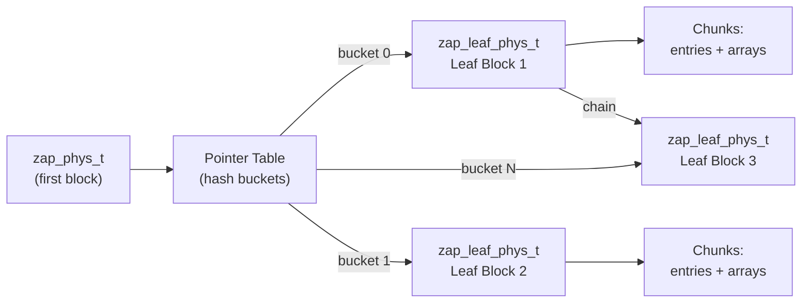

# Chapter 5: ZFS Attribute Processor (ZAP)

> **Source:** `include/sys/zap.h`, `include/sys/zap_impl.h`, `include/sys/zap_leaf.h`, `module/zfs/zap.c`, `module/zfs/zap_micro.c`, `module/zfs/zap_leaf.c`

The ZAP (ZFS Attribute Processor) is a module built on top of the DMU that provides name-value pair storage in objects called **ZAP objects**. ZAP objects are the backbone of ZFS metadata: they store directory entries, dataset properties, pool configuration, and more.

**Attribute format:**
- **Name**: A zero-terminated string of up to 256 bytes (including the null terminator).
- **Value**: An array of integers whose total size is limited by the data block size.

ZAP objects are used for many DMU object types:

| Object Type | Usage |
|-------------|-------|
| `DMU_OT_OBJECT_DIRECTORY` | MOS object directory |
| `DMU_OT_DSL_DIR_CHILD_MAP` | DSL child directory entries |
| `DMU_OT_DSL_DS_SNAP_MAP` | Dataset snapshot name mappings |
| `DMU_OT_DSL_PROPS` | Dataset properties |
| `DMU_OT_DIRECTORY_CONTENTS` | ZPL directory entries |
| `DMU_OT_MASTER_NODE` | ZPL master node |
| `DMU_OT_UNLINKED_SET` | Delete queue |
| `DMU_OT_ZVOL_PROP` | ZVOL properties |

## ZAP Object Forms

ZAP objects come in two forms:

- **Microzap**: A lightweight format optimized for a small number of simple attributes.
- **Fat ZAP** (fatzap): A flexible, hash-based format for large numbers of attributes or complex values.

### Selection Criteria

A microzap is used when **all** of the following conditions are met:

1. All name-value entries fit in a single data block (up to 128 KB = 2047 entries maximum).
2. All values are of type `uint64_t`.
3. All names are 50 characters or fewer (including null terminator).

If any condition is not met, a fat ZAP is used instead.

### Block Type Identifiers

The first 64-bit word of each ZAP block identifies its type:

| Identifier | Value | Description |
|------------|-------|-------------|
| `ZBT_MICRO` | `(1ULL << 63) + 3` | Microzap block |
| `ZBT_HEADER` | `(1ULL << 63) + 1` | Fat ZAP header (first block only) |
| `ZBT_LEAF` | `(1ULL << 63) + 0` | Fat ZAP leaf block |

## 5.1 Microzap

The microzap stores attributes in a single block as a flat array of fixed-size entries.

### Block Layout

```
Microzap Block (up to 128 KB)
+────────────────────────────────────────────────+
| mzap_phys_t header (128 bytes)                 |
|   uint64_t  mz_block_type    = ZBT_MICRO       |
|   uint64_t  mz_salt          (hash salt)        |
|   uint8_t   mz_pad[40]       (reserved)         |
|   mzap_ent_phys_t mz_chunk[0] (first entry)     |
+────────────────────────────────────────────────+
| mzap_ent_phys_t array (remainder of block)     |
|   ...                                          |
+────────────────────────────────────────────────+
```

The first 128 bytes form the header. The first entry occupies the last 64 bytes of the header. The remaining bytes are filled with additional `mzap_ent_phys_t` entries.

### Microzap Entry (`mzap_ent_phys_t`)

Each entry is exactly 64 bytes:

```
mzap_ent_phys_t (64 bytes)
Offset  Size      Field         Description
──────  ────      ─────         ──────────────────────────────────
0x00    8 bytes   mze_value     The uint64_t value
0x08    4 bytes   mze_cd        Collision differentiator
0x0C    2 bytes   mze_pad       Reserved
0x0E    50 bytes  mze_name      Null-terminated attribute name
──────  ────
        64 bytes  total
```

- **`mze_value`**: The attribute's 64-bit integer value.
- **`mze_cd`**: A collision differentiator assigned when two attribute names hash to the same value. The lowest unused CD is assigned. Zero when there are no collisions.
- **`mze_name`**: The attribute name, null-terminated, up to 50 bytes (including the null).

## 5.2 Fat ZAP

The fat ZAP uses a hash-based architecture for storing larger numbers of attributes and/or attributes with long names or non-`uint64_t` values.

### Architecture Overview



All entries are indexed by a 64-bit hash of the attribute name. The high-order bits of the hash select a pointer table bucket, which references a leaf block. Leaf blocks contain the actual attribute data in chunks.

### 5.2.1 `zap_phys_t` (Header Block)

The first block of a fat ZAP object (up to 128 KB) contains the header:

| Field | Type | Description |
|-------|------|-------------|
| `zap_block_type` | `uint64` | Always `ZBT_HEADER` |
| `zap_magic` | `uint64` | `0x2F52AB2AB` ("zfs-zap-zap") |
| `zap_ptrtbl.zt_blk` | `uint64` | Block ID of external pointer table (0 if internal) |
| `zap_ptrtbl.zt_numblks` | `uint64` | Number of blocks in external pointer table (0 if internal) |
| `zap_ptrtbl.zt_shift` | `uint64` | Number of hash bits used to index the pointer table |
| `zap_ptrtbl.zt_nextblk` | `uint64` | Used during pointer table resize |
| `zap_ptrtbl.zt_blks_copied` | `uint64` | Used during pointer table resize |
| `zap_freeblk` | `uint64` | Next available block for new leaf allocation |
| `zap_num_leafs` | `uint64` | Number of leaf blocks |
| `zap_num_entries` | `uint64` | Total number of attributes stored |
| `zap_salt` | `uint64` | Salt stirred into the hash function |
| `zap_pad[8181]` | `uint64[]` | Reserved |
| `zap_leafs[8192]` | `uint64[]` | Internal pointer table (used when zt_shift <= 13) |

If the pointer table has 8192 (2^13) or fewer entries, it is stored inline in the `zap_leafs` array. Otherwise, it is stored externally in separate blocks referenced by `zt_blk`.

### 5.2.2 Pointer Table

The pointer table is a hash table using chaining for collisions. Each bucket contains a 64-bit block ID of the first leaf block for entries hashing to that bucket.

The index into the pointer table is called the **prefix**: the `zt_shift` high-order bits of the 64-bit hash of the attribute name.

### 5.2.3 Leaf Blocks (`zap_leaf_phys_t`)

Leaf blocks hold the actual attribute data. When multiple entries hash to the same pointer table bucket and exceed one leaf's capacity, leaf blocks are chained together.

Each leaf block contains:

1. **Header** (`zap_leaf_header`): 48 bytes (2 chunk-sized slots)
2. **Hash table** (`l_hash`): Maps hash bits to chunk indices
3. **Chunk array** (`l_chunk`): Array of 24-byte chunks

**Leaf Header Fields:**

| Field | Type | Description |
|-------|------|-------------|
| `lhr_block_type` | `uint64` | Always `ZBT_LEAF` |
| `lhr_next` | `uint64` | Block ID of next leaf in chain (0 = end) |
| `lhr_prefix` | `uint64` | Hash prefix for entries in this leaf |
| `lhr_magic` | `uint32` | Leaf magic: `0x2AB1EAF` ("zap-leaf") |
| `lhr_nfree` | `uint16` | Number of free chunks |
| `lhr_nentries` | `uint16` | Number of attribute entries |
| `lhr_prefix_len` | `uint16` | Number of bits in the prefix |
| `lh_freelist` | `uint16` | Index of first free chunk |

**Leaf Hash Table:** 4096 entries of 16-bit integers, each indexing into the chunk array. Twelve bits of the hash (following the prefix bits) select the bucket.

### 5.2.4 Chunks (`zap_leaf_chunk`)

Each chunk is 24 bytes. Chunks come in three types, distinguished by their first byte:

#### Entry Chunk (`zap_leaf_entry`, type = 252)

```
Offset  Size     Field            Description
──────  ────     ─────            ──────────────────────────────
0x00    1 byte   le_type          252 (ZAP_LEAF_ENTRY)
0x01    1 byte   le_int_size      Size of value integers in bytes
0x02    2 bytes  le_next          Next entry in hash chain (0xFFFF = end)
0x04    2 bytes  le_name_chunk    Index of first array chunk holding the name
0x06    2 bytes  le_name_length   Length of name including null terminator
0x08    2 bytes  le_value_chunk   Index of first array chunk holding the value
0x0A    2 bytes  le_value_length  Length of value in le_int_size units
0x0C    4 bytes  le_cd            Collision differentiator
0x10    8 bytes  le_hash          64-bit hash of the attribute name
──────  ────
        24 bytes total
```

#### Array Chunk (`zap_leaf_array`, type = 251)

```
Offset  Size     Field         Description
──────  ────     ─────         ──────────────────────────
0x00    1 byte   la_type       251 (ZAP_LEAF_ARRAY)
0x01    21 bytes la_array      Name or value data
0x16    2 bytes  la_next       Next array chunk (0xFFFF = end)
──────  ────
        24 bytes total
```

Array chunks hold the actual name and value bytes. They are chained together for names or values longer than 21 bytes. Integer values are always stored in **big-endian** format, regardless of machine byte order.

#### Free Chunk (`zap_leaf_free`, type = 253)

```
Offset  Size     Field       Description
──────  ────     ─────       ──────────────────────────
0x00    1 byte   lf_type     253 (ZAP_LEAF_FREE)
0x01    21 bytes lf_pad      Unused
0x16    2 bytes  lf_next     Next free chunk
──────  ────
        24 bytes total
```

Free chunks are maintained in a linked list rooted at the leaf header's `lh_freelist`.

### Putting It Together

A single ZAP attribute is stored as:

1. One **entry chunk** containing the hash, sizes, and collision info.
2. One or more **array chunks** for the name (chained via `la_next`).
3. One or more **array chunks** for the value (chained via `la_next`).

The entry chunk points to the first name chunk (`le_name_chunk`) and first value chunk (`le_value_chunk`). Hash collisions within a leaf are handled by chaining entry chunks via `le_next`.
