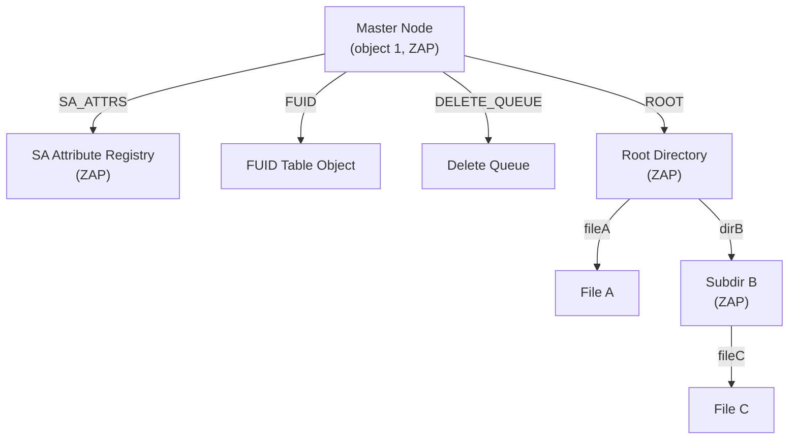

# Chapter 6: ZFS POSIX Layer (ZPL)

> **Source:** `include/sys/zfs_znode.h`, `include/sys/zfs_sa.h`, `include/sys/zfs_acl.h`, `include/sys/fs/zfs.h`, `module/zfs/zfs_sa.c`, `module/zfs/zfs_znode.c`, `module/os/*/zfs/zfs_acl.c`

The ZPL (ZFS POSIX Layer) presents DMU objects as a POSIX-compliant filesystem. ZPL filesystems, snapshots, and clones are all represented as object sets of type `DMU_OST_ZFS`.

## 6.1 ZPL Versions

The ZPL on-disk format has its own version number, stored in the master node `VERSION` attribute. ZPL versions are independent of pool versions but require specific minimum pool versions.

| ZPL Version | Constant | Features Added |
|-------------|----------|----------------|
| 1 | `ZPL_VERSION_INITIAL` | Original format: fixed 264-byte `znode_phys_t` bonus buffer |
| 2 | `ZPL_VERSION_DIRENT_TYPE` | File type field in directory entries (top 4 bits of 64-bit value) |
| 3 | `ZPL_VERSION_FUID` / `ZPL_VERSION_NORMALIZATION` / `ZPL_VERSION_SYSATTR` | FUIDs for Windows SID mapping; case-insensitive and Unicode-normalized lookups; system attributes |
| 4 | `ZPL_VERSION_USERSPACE` | User, group, and project space accounting for quotas |
| 5 | `ZPL_VERSION_SA` | System Attributes (SA) framework replaces fixed `znode_phys_t` with variable-length attribute storage |

All modern filesystems are created at ZPL version 5. Older versions may exist in pools that were created before SA support and have not been upgraded.

## 6.2 Filesystem Object Set

Every ZPL object set has one object at a fixed location: the **master node** at object number 1. The master node is a ZAP object (`DMU_OT_MASTER_NODE`) containing filesystem-wide attributes.

| Attribute | Value Type | Description |
|-----------|-----------|-------------|
| `ROOT` | `uint64` | Object number of the root directory (`DMU_OT_DIRECTORY_CONTENTS`) |
| `DELETE_QUEUE` | `uint64` | Object number of the delete queue (`DMU_OT_UNLINKED_SET`) |
| `VERSION` | `uint64` | ZPL on-disk version (currently `ZPL_VERSION_5`) |
| `SA_ATTRS` | `uint64` | Object number of the SA attribute registry ZAP |
| `FUID` | `uint64` | Object number of the FUID table object |
| `SHARES` | `uint64` | Object number of the legacy shares directory (Solaris) |
| `FSID` | platform-specific | Filesystem identifier (optional/platform-specific) |

`userquota@`, `groupquota@`, and `projectquota@` entries may also appear in the master node to track quota objects.

The **delete queue** (unlinked set) tracks files and directories whose deletion was in progress when the filesystem was force-unmounted or the system failed. On next mount, the queue is processed to complete the deletions and prevent space leaks.



## 6.3 Directories and Directory Traversal

Directories are implemented as ZAP objects of type `DMU_OT_DIRECTORY_CONTENTS`. Each directory entry is a name-value pair where the name is the entry's filename and the value is a packed 64-bit directory entry.

```
63            60 59       48 47                      0
+---------------+-----------+-------------------------+
| d_type (4bit) |  unused   | object number (48-bit)  |
+---------------+-----------+-------------------------+
```

- The **object number** is stored in the low 48 bits.
- The **type** is stored in the top 4 bits (`IFTODT(zp_mode)`), matching `DT_*` values on Linux.
- The middle 12 bits are unused.

Helper macros:

```
ZFS_DIRENT_TYPE(de) BF64_GET(de, 60, 4)
ZFS_DIRENT_OBJ(de)  BF64_GET(de, 0, 48)
```

ZPL version 2 (`ZPL_VERSION_DIRENT_TYPE`) introduced the `d_type` bits. Older versions stored only the object number.

### File Type

The file type is encoded in bits 12-15 of `zp_mode`:

| Type | Constant | Mode Bits | Description |
|------|----------|-----------|-------------|
| FIFO | `S_IFIFO` | `0x1` | Named pipe |
| Character Device | `S_IFCHR` | `0x2` | Character special device |
| Directory | `S_IFDIR` | `0x4` | Directory |
| Block Device | `S_IFBLK` | `0x6` | Block special device |
| Regular File | `S_IFREG` | `0x8` | Regular file |
| Symbolic Link | `S_IFLNK` | `0xA` | Symbolic link |
| Socket | `S_IFSOCK` | `0xC` | Socket |
| Door | `S_IFDOOR` | `0xD` | Door (Solaris IPC) |
| Event Port | `S_IFPORT` | `0xE` | Event port (Solaris) |

### Case Sensitivity and Unicode Normalization

ZPL version 3 (`ZPL_VERSION_NORMALIZATION`) added support for case-insensitive directory lookups and Unicode normalization. These properties are set at filesystem creation time and cannot be changed.

**Case sensitivity** (`casesensitivity` property):

| Value | Constant | Behavior |
|-------|----------|----------|
| 0 | `ZFS_CASE_SENSITIVE` | POSIX-standard case-sensitive lookups (default) |
| 1 | `ZFS_CASE_INSENSITIVE` | All lookups are case-insensitive |
| 2 | `ZFS_CASE_MIXED` | Case-preserving; lookups can request case-insensitive via `FIGNORECASE` flag |

**Unicode normalization** (`normalization` property):

| Form | Description |
|------|-------------|
| `none` | No normalization (default) |
| `formC` | NFC (Canonical Decomposition, followed by Canonical Composition) |
| `formD` | NFD (Canonical Decomposition) |
| `formKC` | NFKC (Compatibility Decomposition, followed by Canonical Composition) |
| `formKD` | NFKD (Compatibility Decomposition) |

When normalization is enabled, the `utf8only` property is automatically set to `on`, restricting filenames to valid UTF-8 sequences. Directory ZAP entries store the original (un-normalized) name, but lookups compare using the normalized form.

> **Source:** `include/sys/zfs_ioctl.h` (`zfs_case_t`), `include/sys/u8_textprep.h`

## 6.4 System Attributes (SA)

Modern ZPL filesystems store inode metadata using **System Attributes (SA)** in the dnode bonus buffer (`DMU_OT_SA`). Each filesystem has an SA attribute registry object (a ZAP) whose object number is stored in the master node under `SA_ATTRS`. The registry maps attribute names to numeric IDs, and those IDs are used in SA layouts. The IDs are **filesystem-specific**: two filesystems can assign different numeric IDs for the same attribute name.

Common ZPL SA attributes:

| Attribute | Size | Type | Description |
|-----------|------|------|-------------|
| `ZPL_ATIME` | 16 | `uint64[2]` | Access time (sec, nsec) |
| `ZPL_MTIME` | 16 | `uint64[2]` | Modification time |
| `ZPL_CTIME` | 16 | `uint64[2]` | Change time |
| `ZPL_CRTIME` | 16 | `uint64[2]` | Creation time |
| `ZPL_GEN` | 8 | `uint64` | Generation (creation txg) |
| `ZPL_MODE` | 8 | `uint64` | POSIX mode bits + type |
| `ZPL_SIZE` | 8 | `uint64` | File size |
| `ZPL_PARENT` | 8 | `uint64` | Parent directory object |
| `ZPL_LINKS` | 8 | `uint64` | Hard link count |
| `ZPL_XATTR` | 8 | `uint64` | Hidden xattr directory object |
| `ZPL_RDEV` | 8 | `uint64` | Device ID for special files |
| `ZPL_FLAGS` | 8 | `uint64` | Persistent ZFS flags (pflags) |
| `ZPL_UID` | 8 | `uint64` | Owner UID or FUID |
| `ZPL_GID` | 8 | `uint64` | Group GID or FUID |
| `ZPL_PROJID` | 8 | `uint64` | Project ID (if enabled) |
| `ZPL_ZNODE_ACL` | 88 | bytes | Legacy ACL header (`zfs_acl_phys_t`) |
| `ZPL_DACL_COUNT` | 8 | `uint64` | ACL entry count (SA ACL) |
| `ZPL_DACL_ACES` | var | bytes | ACL ACE list (SA ACL) |
| `ZPL_SYMLINK` | var | bytes | Symlink target |
| `ZPL_SCANSTAMP` | 32 | bytes | AV scanstamp |
| `ZPL_DXATTR` | var | bytes | Packed `xattr=sa` nvlist |
| `ZPL_PAD` | 32 | bytes | Reserved |

Variable-length attributes are stored in the SA spill block when they do not fit in the bonus buffer.

### FUID Encoding

When `feature@fuid` is enabled (`ZPL_VERSION_FUID` and `SPA_VERSION_FUID`), UID and GID fields store **FUIDs**. A FUID encodes a domain index and RID:

```
FUID_ENCODE(idx, rid) = (idx << 32) | rid
```

The FUID domain table is stored in the master node attribute `FUID`.

### Persistent Flags (`ZPL_FLAGS`)

The `ZPL_FLAGS` attribute is a 64-bit value. The lower 32 bits store ACL-related and object-type flags. The upper 32 bits store DOS/Windows-compatible and system attribute flags.

**Lower 32 bits (ACL and object flags):**

| Flag | Value | Description |
|------|-------|-------------|
| `ZFS_XATTR` | `0x1` | Object is an extended attribute directory |
| `ZFS_INHERIT_ACE` | `0x2` | ACL has inheritable ACEs |
| `ZFS_ACL_TRIVIAL` | `0x4` | ACL is trivial (can be represented as mode bits) |
| `ZFS_ACL_OBJ_ACE` | `0x8` | ACL includes CIFS object ACEs |
| `ZFS_ACL_PROTECTED` | `0x10` | ACL is protected from inheritance |
| `ZFS_ACL_DEFAULTED` | `0x20` | ACL should be defaulted |
| `ZFS_ACL_AUTO_INHERIT` | `0x40` | ACL should be auto-inherited |
| `ZFS_BONUS_SCANSTAMP` | `0x80` | Anti-virus scanstamp stored in bonus area |
| `ZFS_NO_EXECS_DENIED` | `0x100` | Exec permission not denied to anyone |

**Upper 32 bits (system attribute flags):**

| Flag | Value | Description |
|------|-------|-------------|
| `ZFS_READONLY` | `0x0000000100000000` | Read-only (DOS attribute) |
| `ZFS_HIDDEN` | `0x0000000200000000` | Hidden (DOS attribute) |
| `ZFS_SYSTEM` | `0x0000000400000000` | System (DOS attribute) |
| `ZFS_ARCHIVE` | `0x0000000800000000` | Archive (DOS attribute) |
| `ZFS_IMMUTABLE` | `0x0000001000000000` | Immutable (BSD-style, cannot modify) |
| `ZFS_NOUNLINK` | `0x0000002000000000` | Cannot unlink |
| `ZFS_APPENDONLY` | `0x0000004000000000` | Append-only |
| `ZFS_NODUMP` | `0x0000008000000000` | Excluded from dumps |
| `ZFS_OPAQUE` | `0x0000010000000000` | Opaque (Solaris) |
| `ZFS_AV_QUARANTINED` | `0x0000020000000000` | Anti-virus quarantined |
| `ZFS_AV_MODIFIED` | `0x0000040000000000` | Modified since last AV scan |
| `ZFS_REPARSE` | `0x0000080000000000` | Reparse point (Solaris/Windows) |
| `ZFS_OFFLINE` | `0x0000100000000000` | Offline |
| `ZFS_SPARSE` | `0x0000200000000000` | Sparse file |
| `ZFS_PROJINHERIT` | `0x0000400000000000` | Children inherit project ID |
| `ZFS_PROJID` | `0x0000800000000000` | Object has a project ID |

The upper-32-bit flags were introduced with `ZPL_VERSION_SYSATTR` (version 3) for Windows/CIFS compatibility. The `ZFS_PROJINHERIT` and `ZFS_PROJID` flags were added later with `ZPL_VERSION_USERSPACE` (version 4) for project quota support.

### Extended Attributes

ZFS supports two on-disk storage modes for POSIX extended attributes (xattrs), controlled by the `xattr` property:

**`xattr=dir` (traditional, default before OpenZFS 0.8):**
Each file's xattrs are stored in a hidden directory object referenced by the `ZPL_XATTR` SA attribute. Each xattr is a separate file within this hidden directory. This approach incurs overhead from the extra directory and per-xattr objects but has no size limits beyond the maximum file size.

**`xattr=sa` (inline, default in modern OpenZFS):**
Xattrs are packed as an XDR-encoded nvlist and stored directly in the `ZPL_DXATTR` SA attribute within the dnode bonus buffer or spill block. This avoids extra I/O for small xattrs (common for SELinux labels, ACLs, etc.).

Size limits for `xattr=sa`:

- Maximum single xattr value: `DXATTR_MAX_ENTRY_SIZE` = 32768 bytes
- Maximum total packed nvlist: `DXATTR_MAX_SA_SIZE` = `SPA_OLD_MAXBLOCKSIZE >> 1` (64 KB)

If the total packed xattr data exceeds the bonus buffer, it spills to a spill block (see [Chapter 3, Section 3.4](03-dmu.md#34-spill-blocks)). If it exceeds `DXATTR_MAX_SA_SIZE`, the system falls back to the directory-based approach for that file.

Both modes can coexist: a file may have some xattrs in the SA and others in the xattr directory. The `ZPL_XATTR` attribute (directory object number) and `ZPL_DXATTR` attribute (packed nvlist) are independent.

> **Source:** `include/sys/zfs_sa.h` (`DXATTR_MAX_ENTRY_SIZE`, `DXATTR_MAX_SA_SIZE`)

### Project Quotas

ZPL version 4 (`ZPL_VERSION_USERSPACE`) added space accounting per user, group, and project. Project quotas allow grouping unrelated files under a common accounting identifier.

Each file's project ID is stored in the `ZPL_PROJID` SA attribute (8 bytes, `uint64`). The default project ID is 0 (`ZFS_DEFAULT_PROJID`). Two persistent flags control project behavior:

- `ZFS_PROJID` (`0x0000800000000000`): Indicates the object has a non-default project ID.
- `ZFS_PROJINHERIT` (`0x0000400000000000`): New children inherit the parent directory's project ID.

Project quota tracking objects are stored in the master node under `projectquota@` entries, analogous to `userquota@` and `groupquota@`.

> **Source:** `include/sys/zfs_project.h`, `include/sys/zfs_znode.h`

## 6.5 Legacy `znode_phys_t` (Pre-SA)

Filesystems created before `ZPL_VERSION_SA` (version 5) may store metadata in a fixed `znode_phys_t` bonus buffer (`DMU_OT_ZNODE`). This layout is deprecated but still relevant for old pools or on-disk conversion.

```
znode_phys_t (legacy)
Offset  Size      Field          Description
──────  ────      ─────          ──────────────────────────────────
0x00    16 bytes  zp_atime[2]    Last access time (sec, nsec)
0x10    16 bytes  zp_mtime[2]    Last modification time
0x20    16 bytes  zp_ctime[2]    Last change time
0x30    16 bytes  zp_crtime[2]   Creation time
0x40    8 bytes   zp_gen         Generation number (creation txg)
0x48    8 bytes   zp_mode        File mode bits and file type
0x50    8 bytes   zp_size        File size in bytes
0x58    8 bytes   zp_parent      Object number of parent directory
0x60    8 bytes   zp_links       Number of hard links
0x68    8 bytes   zp_xattr       Object number of hidden xattr directory
0x70    8 bytes   zp_rdev        Device number (for S_IFCHR/S_IFBLK)
0x78    8 bytes   zp_flags       Persistent flags
0x80    8 bytes   zp_uid         Owner UID
0x88    8 bytes   zp_gid         Owning group GID
0x90    8 bytes   zp_zap         Extra attribute ZAP object (legacy)
0x98    24 bytes  zp_pad[3]      Reserved
0xB0    88 bytes  zp_acl         `zfs_acl_phys_t` (legacy ACL header)
```

The total `znode_phys_t` size is 264 bytes (`ZFS_OLD_ZNODE_PHYS_SIZE` = 0x108). In a standard 512-byte dnode, the bonus buffer is 320 bytes (512 − 192 byte dnode core), leaving 56 bytes after the znode for inline data:

```
|<---------------------- dnode_phys (512) ------------------------>|
|<-- dnode (192) --->|<----------- "bonus" buffer (320) ---------->|
                     |<---- znode (264) ---->|<---- data (56) ---->|
```

This 56-byte data area stores:

- **Symlink targets**: Short symlink paths (up to 56 bytes) are stored inline. Longer targets are stored in a separate DMU object pointed to by the dnode's block pointers.
- **AV scanstamp**: A 32-byte anti-virus scan result (regular files only), indicated by the `ZFS_BONUS_SCANSTAMP` flag.

## 6.6 Access Control Lists

ZFS ACLs are stored in several formats depending on filesystem version.

### SA ACLs (Modern)

On SA-enabled filesystems, ACLs are stored in SA attributes.

- `ZPL_DACL_COUNT` holds the ACE count.
- `ZPL_DACL_ACES` holds the variable-length ACE list.

The ACE list uses `zfs_ace_hdr_t` / `zfs_ace_t` / `zfs_object_ace_t` entries.

```
zfs_ace_hdr_t (8 bytes)
Offset  Size  Field
0x00    2     z_type
0x02    2     z_flags
0x04    4     z_access_mask

zfs_ace_t (16 bytes)
Offset  Size  Field
0x00    8     z_hdr (zfs_ace_hdr_t)
0x08    8     z_fuid

zfs_object_ace_t (48 bytes)
Offset  Size  Field
0x00    16    z_ace (zfs_ace_t)
0x10    16    z_object_type (GUID)
0x20    16    z_inherit_type (GUID)
```

For `owner@`, `group@`, and `everyone@` entries, only the 8-byte header is stored (no `z_fuid`). For user/group entries, `z_fuid` encodes the FUID.

### Legacy Inline ACL Header

Older non-SA filesystems store a fixed ACL header in the znode bonus buffer. There are two ACL versions:

- **Version 0** (`ZFS_ACL_VERSION_INITIAL`): Uses 12-byte `zfs_oldace_t` entries with 32-bit UIDs.
- **Version 1** (`ZFS_ACL_VERSION_FUID`): Uses variable-size ACE entries with 64-bit FUIDs (introduced with `ZPL_VERSION_FUID`).

Both versions use the same 88-byte `zfs_acl_phys_t` header with space for 6 inline ACE slots (`ACE_SLOT_CNT` = 6, `ZFS_ACE_SPACE` = 72 bytes):

```
zfs_acl_phys_t (legacy, 88 bytes)
Offset  Size  Field              Description
0x00    8     z_acl_extern_obj   External ACL object (0 if inline only)
0x08    4     z_acl_size         ACL size in bytes
0x0C    2     z_acl_version      ACL version (0 = initial, 1 = FUID)
0x0E    2     z_acl_count        ACE count
0x10    72    z_ace_data[6]      Inline ACE space
```

In version 0, the inline space holds up to 6 `zfs_oldace_t` entries (12 bytes each):

```
zfs_oldace_t (12 bytes)
Offset  Size  Field
0x00    4     z_fuid          32-bit UID
0x04    4     z_access_mask   Permission bits
0x08    2     z_flags         Inheritance flags
0x0A    2     z_type          ACE type (allow/deny)
```

In version 1, the inline space holds variable-size `zfs_ace_hdr_t` / `zfs_ace_t` entries (8 or 16 bytes each), fitting more entries when abstract ACEs (`owner@`, `group@`, `everyone@`) are used.

If more ACEs are needed than fit inline, the full ACL is stored in a separate object of type `DMU_OT_ACL`, referenced by `z_acl_extern_obj`.

### Access Mask Values

| Constant | Value | Description |
|----------|-------|-------------|
| `ACE_READ_DATA` / `ACE_LIST_DIRECTORY` | `0x00000001` | Read file / list directory |
| `ACE_WRITE_DATA` / `ACE_ADD_FILE` | `0x00000002` | Write file / add file to dir |
| `ACE_APPEND_DATA` / `ACE_ADD_SUBDIRECTORY` | `0x00000004` | Append / add subdir |
| `ACE_READ_NAMED_ATTRS` | `0x00000008` | Read named attributes |
| `ACE_WRITE_NAMED_ATTRS` | `0x00000010` | Write named attributes |
| `ACE_EXECUTE` | `0x00000020` | Execute file / traverse dir |
| `ACE_DELETE_CHILD` | `0x00000040` | Delete child entries |
| `ACE_READ_ATTRIBUTES` | `0x00000080` | Read basic attributes |
| `ACE_WRITE_ATTRIBUTES` | `0x00000100` | Write basic attributes |
| `ACE_DELETE` | `0x00010000` | Delete this object |
| `ACE_READ_ACL` | `0x00020000` | Read ACL |
| `ACE_WRITE_ACL` | `0x00040000` | Write ACL |
| `ACE_WRITE_OWNER` | `0x00080000` | Change owner |
| `ACE_SYNCHRONIZE` | `0x00100000` | Synchronize access |

### ACE Flags

| Constant | Value | Description |
|----------|-------|-------------|
| `ACE_FILE_INHERIT_ACE` | `0x0001` | Inherit to files |
| `ACE_DIRECTORY_INHERIT_ACE` | `0x0002` | Inherit to directories |
| `ACE_NO_PROPAGATE_INHERIT_ACE` | `0x0004` | Don't propagate inheritance |
| `ACE_INHERIT_ONLY_ACE` | `0x0008` | Inherit only (not effective on this object) |
| `ACE_SUCCESSFUL_ACCESS_ACE_FLAG` | `0x0010` | Audit successful access |
| `ACE_FAILED_ACCESS_ACE_FLAG` | `0x0020` | Audit failed access |
| `ACE_IDENTIFIER_GROUP` | `0x0040` | `z_fuid` is a GID (not UID) |
| `ACE_OWNER` | `0x1000` | Applies to file owner |
| `ACE_GROUP` | `0x2000` | Applies to file group |
| `ACE_EVERYONE` | `0x4000` | Applies to everyone |

### ACE Types

| Constant | Value | Description |
|----------|-------|-------------|
| `ACE_ACCESS_ALLOWED_ACE_TYPE` | `0x0000` | Grant access |
| `ACE_ACCESS_DENIED_ACE_TYPE` | `0x0001` | Deny access |
| `ACE_SYSTEM_AUDIT_ACE_TYPE` | `0x0002` | Audit access |
| `ACE_SYSTEM_ALARM_ACE_TYPE` | `0x0003` | Alarm on access |
