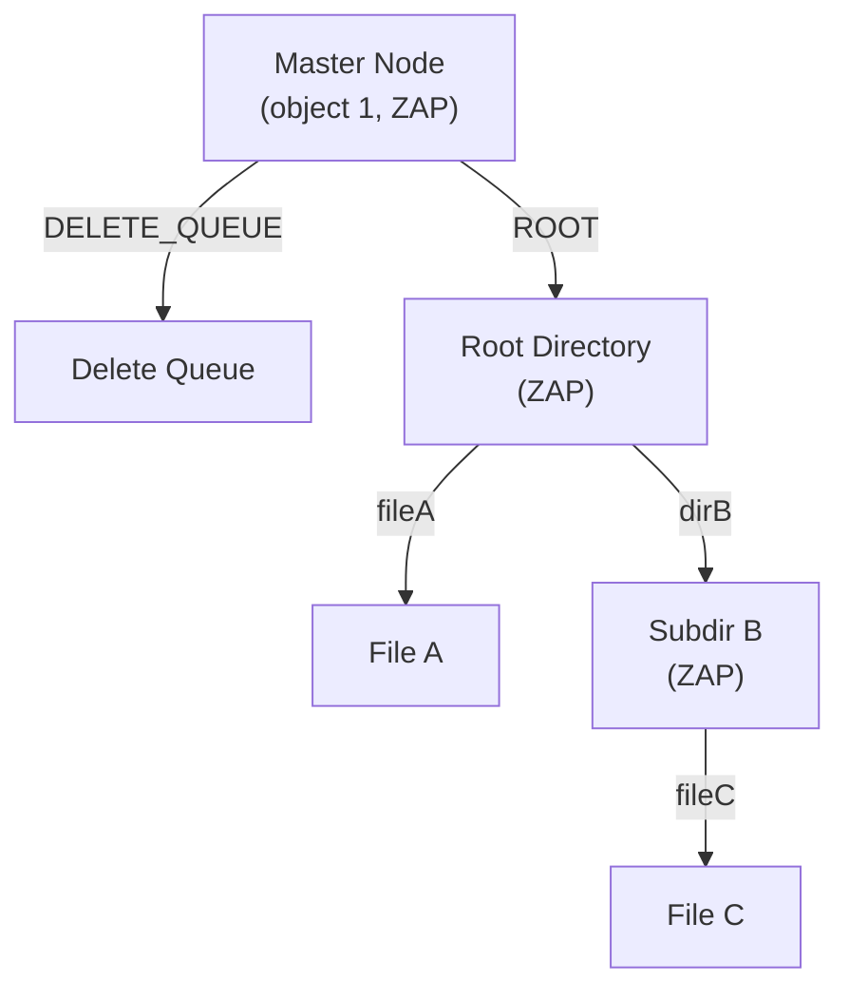

# Chapter 6: ZFS POSIX Layer (ZPL)

> **Source:** `include/sys/zfs_znode.h`, `include/sys/zfs_sa.h`, `module/zfs/zfs_znode.c`

The ZPL (ZFS POSIX Layer) presents DMU objects as a POSIX-compliant filesystem. ZPL filesystems, snapshots, and clones are all represented as object sets of type `DMU_OST_ZFS`.

## 6.1 Filesystem Layout

Every ZPL object set has one object at a fixed location: the **master node** at object number 1. The master node is a ZAP object containing three attributes:

| Attribute | Value Type | Description |
|-----------|-----------|-------------|
| `DELETE_QUEUE` | `uint64` | Object number of the delete queue (unlinked set) |
| `VERSION` | `uint64` | ZPL version used for this filesystem |
| `ROOT` | `uint64` | Object number of the root directory |

The **delete queue** (unlinked set) tracks files and directories whose deletion was in progress when the filesystem was force-unmounted or the system failed. On next mount, the queue is processed to complete the deletions and prevent space leaks.



## 6.2 Directories and Directory Traversal

Directories are implemented as ZAP objects of type `DMU_OT_DIRECTORY_CONTENTS`. Each directory entry is a name-value pair where the name is the entry's filename and the value is the 64-bit object number of the referenced filesystem object. Traversing a directory tree is accomplished by looking up names in ZAP objects and following the object numbers.

### File Metadata: `znode_phys_t`

All filesystem objects (files, directories, symlinks, etc.) store their metadata in the dnode's bonus buffer as a `znode_phys_t` structure.

> **Source:** `include/sys/zfs_znode.h`

```
znode_phys_t
Offset  Size      Field          Description
──────  ────      ─────          ──────────────────────────────────
0x00    16 bytes  zp_atime[2]    Last access time (seconds + nanoseconds)
0x10    16 bytes  zp_mtime[2]    Last modification time
0x20    16 bytes  zp_ctime[2]    Last change time
0x30    16 bytes  zp_crtime[2]   Creation time
0x40    8 bytes   zp_gen         Generation number (creation txg)
0x48    8 bytes   zp_mode        File mode bits and file type
0x50    8 bytes   zp_size        File size in bytes
0x58    8 bytes   zp_parent      Object number of parent directory
0x60    8 bytes   zp_links       Number of hard links
0x68    8 bytes   zp_xattr       Object number of hidden xattr directory
0x70    8 bytes   zp_rdev        Device number (for S_IFCHR/S_IFBLK)
0x78    8 bytes   zp_flags       Persistent flags
0x80    8 bytes   zp_uid         Owner UID
0x88    8 bytes   zp_gid         Owning group GID
0x90    32 bytes  zp_pad[4]      Reserved
0xB0    variable  zp_acl         Inline ACL data (zfs_znode_acl_t)
```

All timestamps are stored as two 64-bit integers: seconds since 1970-01-01 00:00:00 UTC followed by nanoseconds.

### File Type

The file type is encoded in bits 12-15 of `zp_mode`:

| Type | Constant | Mode Bits | Description |
|------|----------|-----------|-------------|
| FIFO | `S_IFIFO` | `0x1` | Named pipe |
| Character Device | `S_IFCHR` | `0x2` | Character special device |
| Directory | `S_IFDIR` | `0x4` | Directory |
| Block Device | `S_IFBLK` | `0x6` | Block special device |
| Regular File | `S_IFREG` | `0x8` | Regular file |
| Symbolic Link | `S_IFLNK` | `0xA` | Symbolic link |
| Socket | `S_IFSOCK` | `0xC` | Socket |
| Door | `S_IFDOOR` | `0xD` | Door (Solaris IPC) |
| Event Port | `S_IFPORT` | `0xE` | Event port (Solaris) |

### Persistent Flags (`zp_flags`)

| Flag | Value | Description |
|------|-------|-------------|
| `ZFS_XATTR` | `0x1` | This object is an extended attribute directory |
| `ZFS_INHERIT_ACE` | `0x2` | ACEs should be inherited |

## 6.3 Access Control Lists

ZFS implements access control using ACLs (Access Control Lists) composed of ACEs (Access Control Entries).

### `zfs_znode_acl_t`

The ACL structure is stored inline in the `znode_phys_t`:

```c
#define ACE_SLOT_CNT  6

typedef struct zfs_znode_acl {
    uint64_t  z_acl_extern_obj;    /* Object for ACLs > 6 ACEs */
    uint32_t  z_acl_count;         /* Number of ACE entries */
    uint16_t  z_acl_version;       /* ACL version */
    uint16_t  z_acl_pad;           /* Reserved */
    ace_t     z_ace_data[ACE_SLOT_CNT]; /* Up to 6 inline ACEs */
} zfs_znode_acl_t;
```

Up to 6 ACEs are stored inline. If more are needed, they are stored in a separate object of type `DMU_OT_ACL`, referenced by `z_acl_extern_obj`.

### ACE Structure (`ace_t`)

Each ACE is 16 bytes:

```
Offset  Size     Field          Description
──────  ────     ─────          ──────────────────────────────
0x00    4 bytes  a_who          UID or GID (meaningful only when
                                ACE_OWNER/GROUP/EVERYONE not set)
0x04    4 bytes  a_access_mask  Bitmask of access rights
0x08    2 bytes  a_flags        Entry type and inheritance flags
0x0A    2 bytes  a_type         ACE type (allow/deny/audit/alarm)
```

### Access Mask Values

| Constant | Value | Description |
|----------|-------|-------------|
| `ACE_READ_DATA` / `ACE_LIST_DIRECTORY` | `0x00000001` | Read file / list directory |
| `ACE_WRITE_DATA` / `ACE_ADD_FILE` | `0x00000002` | Write file / add file to dir |
| `ACE_APPEND_DATA` / `ACE_ADD_SUBDIRECTORY` | `0x00000004` | Append / add subdir |
| `ACE_READ_NAMED_ATTRS` | `0x00000008` | Read named attributes |
| `ACE_WRITE_NAMED_ATTRS` | `0x00000010` | Write named attributes |
| `ACE_EXECUTE` | `0x00000020` | Execute file / traverse dir |
| `ACE_DELETE_CHILD` | `0x00000040` | Delete child entries |
| `ACE_READ_ATTRIBUTES` | `0x00000080` | Read basic attributes |
| `ACE_WRITE_ATTRIBUTES` | `0x00000100` | Write basic attributes |
| `ACE_DELETE` | `0x00010000` | Delete this object |
| `ACE_READ_ACL` | `0x00020000` | Read ACL |
| `ACE_WRITE_ACL` | `0x00040000` | Write ACL |
| `ACE_WRITE_OWNER` | `0x00080000` | Change owner |
| `ACE_SYNCHRONIZE` | `0x00100000` | Synchronize access |

### ACE Flags

| Constant | Value | Description |
|----------|-------|-------------|
| `ACE_FILE_INHERIT_ACE` | `0x0001` | Inherit to files |
| `ACE_DIRECTORY_INHERIT_ACE` | `0x0002` | Inherit to directories |
| `ACE_NO_PROPAGATE_INHERIT_ACE` | `0x0004` | Don't propagate inheritance |
| `ACE_INHERIT_ONLY_ACE` | `0x0008` | Inherit only (not effective on this object) |
| `ACE_SUCCESSFUL_ACCESS_ACE_FLAG` | `0x0010` | Audit successful access |
| `ACE_FAILED_ACCESS_ACE_FLAG` | `0x0020` | Audit failed access |
| `ACE_IDENTIFIER_GROUP` | `0x0040` | `a_who` is a GID (not UID) |
| `ACE_OWNER` | `0x1000` | Applies to file owner |
| `ACE_GROUP` | `0x2000` | Applies to file group |
| `ACE_EVERYONE` | `0x4000` | Applies to everyone |

### ACE Types

| Constant | Value | Description |
|----------|-------|-------------|
| `ACE_ACCESS_ALLOWED_ACE_TYPE` | `0x0000` | Grant access |
| `ACE_ACCESS_DENIED_ACE_TYPE` | `0x0001` | Deny access |
| `ACE_SYSTEM_AUDIT_ACE_TYPE` | `0x0002` | Audit access |
| `ACE_SYSTEM_ALARM_ACE_TYPE` | `0x0003` | Alarm on access |
