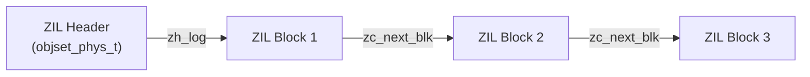

# Chapter 7: ZFS Intent Log (ZIL)

> **Source:** `include/sys/zil.h`, `include/sys/zil_impl.h`, `include/sys/zio.h`, `module/zfs/zil.c`, `module/zfs/zfs_log.c`, `module/zfs/zfs_replay.c`

The ZFS Intent Log (ZIL) records filesystem operations that require synchronous semantics (for example `fsync`, `O_DSYNC`, and `O_SYNC`). These log records are collected in memory and written to on-disk **log blocks** when required. When the corresponding DMU transaction group (txg) commits, the log records are obsolete and can be discarded. After a crash or power loss, the ZIL is replayed to bring the filesystem to a consistent, synchronous state.

There is one ZIL per filesystem (objset). Its on-disk format has three parts:

1. **ZIL header** stored in the objset
2. **ZIL blocks** chained together
3. **ZIL records** packed into the blocks



## 7.1 ZIL Header (`zil_header_t`)

The ZIL header is stored in `objset_phys_t.os_zil_header` (see [Chapter 3](03-dmu.md#32-object-sets)).

```c
typedef struct zil_header {
    uint64_t    zh_claim_txg;       /* txg in which log blocks were claimed */
    uint64_t    zh_replay_seq;      /* highest replayed record sequence */
    blkptr_t    zh_log;             /* block pointer to first log block */
    uint64_t    zh_claim_blk_seq;   /* highest claimed log block sequence */
    uint64_t    zh_flags;           /* header flags */
    uint64_t    zh_claim_lr_seq;    /* highest claimed log record sequence */
    uint64_t    zh_pad[3];
} zil_header_t;
```

| Field | Description |
|-------|-------------|
| `zh_claim_txg` | Txg in which log blocks were claimed during import/replay. |
| `zh_replay_seq` | Highest log record sequence number replayed. |
| `zh_log` | Block pointer to the first ZIL block (zero if the log is empty). |
| `zh_claim_blk_seq` | Highest claimed ZIL block sequence number. |
| `zh_flags` | Header flags (see below). |
| `zh_claim_lr_seq` | Highest claimed log record sequence number (if valid). |

Header flags (`zh_flags`):

| Flag | Value | Description |
|------|-------|-------------|
| `ZIL_REPLAY_NEEDED` | `0x1` | Replay needed (internal use). |
| `ZIL_CLAIM_LR_SEQ_VALID` | `0x2` | `zh_claim_lr_seq` contains valid data. |

## 7.2 ZIL Blocks and Chaining

Log blocks are allocated on demand and may be placed on the main pool or on a separate log device (SLOG). Blocks are at least `ZIL_MIN_BLKSZ` (4 KiB). Each block contains log records plus a single **chain header** (`zil_chain_t`) which links the blocks.

```c
typedef struct zil_chain {
    uint64_t    zc_pad;
    blkptr_t    zc_next_blk;    /* next block in chain */
    uint64_t    zc_nused;       /* bytes used in this log block */
    zio_eck_t   zc_eck;         /* embedded checksum */
} zil_chain_t;
```

Two on-disk layouts are supported:

- **Legacy layout**: `zil_chain_t` is placed at the end of the block (as a trailer).
- **Slim layout**: `zil_chain_t` is placed at the beginning of the block, allowing partial writes of the used portion only.

```
Legacy layout:
+--------------------- records ---------------------+ zil_chain_t

Slim layout:
+ zil_chain_t +--------------------- records ---------------------+
```

`zc_eck` is an **embedded checksum** (`zio_eck_t`) that contains a magic value and a 256-bit checksum. For ZIL blocks, the embedded checksum is used to validate the **log block sequence number** against the block pointer checksum words.

Sequence numbers are stored in the block pointer checksum words:

| Index | Meaning |
|-------|---------|
| `ZIL_ZC_GUID_0` | Pool GUID word 0 |
| `ZIL_ZC_GUID_1` | Pool GUID word 1 |
| `ZIL_ZC_OBJSET` | Objset ID |
| `ZIL_ZC_SEQ` | Log block sequence number |

A sequence number of 0 is invalid. ZIL blocks use checksum types `ZIO_CHECKSUM_ZILOG` (legacy) or `ZIO_CHECKSUM_ZILOG2` (slim).

## 7.3 Log Records

Each log record begins with a common header:

```c
typedef struct {
    uint64_t    lrc_txtype;     /* transaction type */
    uint64_t    lrc_reclen;     /* record length in bytes */
    uint64_t    lrc_txg;        /* txg when the record was created */
    uint64_t    lrc_seq;        /* record sequence number */
} lr_t;
```

Notes:

- `lrc_txtype` may have the high bit (`TX_CI`) set to indicate **case-insensitive** handling of names.
- `lrc_reclen` includes any padding; records are aligned to 8 bytes.

### Out-of-Order Records

Certain record types can be logged and replayed out of order. For these types, `lr_foid` is at a common offset and is described by `lr_ooo_t`:

```c
typedef struct {
    lr_t        lr_common;
    uint64_t    lr_foid;        /* object id (encoded, see below) */
} lr_ooo_t;
```

### Encoded Object IDs (`lr_foid`)

The upper 8 bits of `lr_foid` store the number of dnode slots used by the object, minus one. The lower bits store the object number.

```
LR_FOID_GET_SLOTS(oid) = BF64_GET(oid, 56, 8) + 1
LR_FOID_GET_OBJ(oid)   = BF64_GET(oid, 0, DN_MAX_OBJECT_SHIFT)
```

## 7.4 Transaction Types

| Value | Constant | Description | Record Structure |
|-------|----------|-------------|-----------------|
| 0 | `TX_COMMIT` | Commit marker (no on-disk record) | none |
| 1 | `TX_CREATE` | Create file | `lr_create_t` |
| 2 | `TX_MKDIR` | Create directory | `lr_create_t` |
| 3 | `TX_MKXATTR` | Create xattr dir | `lr_create_t` |
| 4 | `TX_SYMLINK` | Create symlink | `lr_create_t` |
| 5 | `TX_REMOVE` | Remove file | `lr_remove_t` |
| 6 | `TX_RMDIR` | Remove directory | `lr_remove_t` |
| 7 | `TX_LINK` | Create hard link | `lr_link_t` |
| 8 | `TX_RENAME` | Rename | `lr_rename_t` |
| 9 | `TX_WRITE` | Write | `lr_write_t` |
| 10 | `TX_TRUNCATE` | Truncate | `lr_truncate_t` |
| 11 | `TX_SETATTR` | Set attributes | `lr_setattr_t` |
| 12 | `TX_ACL_V0` | Set old-format ACL | `lr_acl_v0_t` |
| 13 | `TX_ACL` | Set ACL (FUID-aware) | `lr_acl_t` |
| 14 | `TX_CREATE_ACL` | Create with ACL | `lr_acl_create_t` |
| 15 | `TX_CREATE_ATTR` | Create with xvattr | `lr_create_t` + `lr_attr_t` |
| 16 | `TX_CREATE_ACL_ATTR` | Create with ACL + xvattr | `lr_acl_create_t` + `lr_attr_t` |
| 17 | `TX_MKDIR_ACL` | Mkdir with ACL | `lr_acl_create_t` |
| 18 | `TX_MKDIR_ATTR` | Mkdir with xvattr | `lr_create_t` + `lr_attr_t` |
| 19 | `TX_MKDIR_ACL_ATTR` | Mkdir with ACL + xvattr | `lr_acl_create_t` + `lr_attr_t` |
| 20 | `TX_WRITE2` | Write (dmu_sync EALREADY path) | `lr_write_t` |
| 21 | `TX_SETSAXATTR` | Set `xattr=sa` data (requires `feature@zilsaxattr`) | `lr_setsaxattr_t` |
| 22 | `TX_RENAME_EXCHANGE` | Atomic rename exchange (Linux `renameat2` `RENAME_EXCHANGE`) | `lr_rename_t` |
| 23 | `TX_RENAME_WHITEOUT` | Atomic rename with whiteout (Linux `renameat2` `RENAME_WHITEOUT`) | `lr_rename_whiteout_t` |
| 24 | `TX_CLONE_RANGE` | Clone file range | `lr_clone_range_t` |

`TX_CI` may be ORed into the type for `TX_MKDIR`, `TX_SYMLINK`, `TX_REMOVE`, `TX_RMDIR`, `TX_LINK`, and `TX_RENAME` to indicate case-insensitive lookup semantics.

## 7.5 Record Structures

### `lr_create_t` and `lr_acl_create_t`

Common create fields:

```
_lr_create_t
Field        Description
lr_common    Common log record header
lr_doid      Parent directory object
lr_foid      Object number of new file/dir
lr_mode      Mode bits
lr_uid       Owner UID or FUID
lr_gid       Group GID or FUID
lr_gen       Generation (creation txg)
lr_crtime    Creation time (sec, nsec)
lr_rdev      Device number (special files)
```

`lr_create_t` appends variable data:

- Optional `lr_attr_t` (xvattr) for `*_ATTR` record types.
- Name of the created object.
- For symlinks, the link target follows the name.

`lr_acl_create_t` extends `_lr_create_t` with ACL metadata:

```
lr_acl_create_t
Field           Description
lr_aclcnt       ACE count
lr_domcnt       Unique domain count
lr_fuidcnt      FUID count
lr_acl_bytes    ACL data bytes
lr_acl_flags    ACL flags
```

After the fixed fields, the payload may include optional xvattr data, ACL data, FUID data, a domain table, and then the name (and symlink target if present).

### `lr_remove_t`

```
Field        Description
lr_common    Common log record header
lr_doid      Parent directory object
```

The name of the removed entry follows the fixed fields.

### `lr_link_t`

```
Field        Description
lr_common    Common log record header
lr_doid      Directory object
lr_link_obj  Target object number
```

The link name follows the fixed fields.

### `lr_rename_t` and `lr_rename_whiteout_t`

`lr_rename_t` contains source and target directory IDs followed by two strings: source name and destination name.

`lr_rename_whiteout_t` adds a whiteout create payload (fields mirroring `_lr_create_t`) before the two names.

### `lr_write_t`

```
Field        Description
lr_common    Common log record header
lr_foid      Object number of the file
lr_offset    Byte offset to write at
lr_length    Length of write
lr_blkoff    Reserved (no longer used)
lr_blkptr    Block pointer for indirect writes
```

Writes use one of three modes:

- **`WR_COPIED`**: Data is copied directly into the log record after the fixed fields (small synchronous writes).
- **`WR_INDIRECT`**: The data block is written to the pool via `dmu_sync()` and only the resulting block pointer is stored in `lr_blkptr`. Used for large writes when no SLOG is present.
- **`WR_NEED_COPY`**: No data is stored immediately; if the record must be flushed before txg commit, the data is retrieved from the DMU and copied at that time.

`TX_WRITE2` (value 20) is used when a `dmu_sync()` for an indirect write returns EALREADY (the block was already synced by the txg). The record is still logged to preserve ordering but carries no data or block pointer.

### `lr_truncate_t`

```
Field        Description
lr_common    Common log record header
lr_foid      Object number of the file
lr_offset    Truncate offset
lr_length    Length to truncate
```

### `lr_setattr_t`

```
Field        Description
lr_common    Common log record header
lr_foid      Object number of the file
lr_mask      Attribute mask
lr_mode      New mode
lr_uid       New UID
lr_gid       New GID
lr_size      New size
lr_atime     New access time
lr_mtime     New modification time
```

An optional `lr_attr_t` may follow to record extended attributes (xvattr).

### `lr_attr_t` (xvattr)

`lr_attr_t` is a variable-length attribute payload used by create and setattr records:

```
Field              Description
lr_attr_masksize   Number of 32-bit bitmap elements
lr_attr_bitmap     First bitmap element
lr_attr_data       Remaining bitmap elements, then lr_attr_end_t
```

`lr_attr_end_t` appends the actual data:

```
Field              Description
lr_attr_attrs      Packed attribute values
lr_attr_crtime     Creation time (sec, nsec)
lr_attr_scanstamp  32-byte scanstamp
```

### `lr_setsaxattr_t`

```
Field        Description
lr_common    Common log record header
lr_foid      Object number of the file
lr_size      Value size in bytes
```

The xattr name and value follow the fixed fields. The value is the raw xattr bytes.

### ACL Records

`TX_ACL_V0` (`lr_acl_v0_t`) uses fixed-size v0 ACEs:

```
Field        Description
lr_common    Common log record header
lr_foid      Object number of the file
lr_aclcnt    ACE count
```

`TX_ACL` (`lr_acl_t`) uses variable-size, FUID-aware ACEs:

```
Field        Description
lr_common    Common log record header
lr_foid      Object number of the file
lr_aclcnt    ACE count
lr_domcnt    Unique domain count
lr_fuidcnt   FUID count
lr_acl_bytes ACL data bytes
lr_acl_flags ACL flags
```

The ACL data follows the fixed fields, optionally followed by FUID and domain tables.

### `lr_clone_range_t`

```
Field        Description
lr_common    Common log record header
lr_foid      Target file object
lr_offset    Offset to clone into
lr_length    Length of range
lr_blksz     File block size
lr_nbps      Number of block pointers
```

`lr_nbps` block pointers follow the fixed fields and identify the source blocks to clone.
