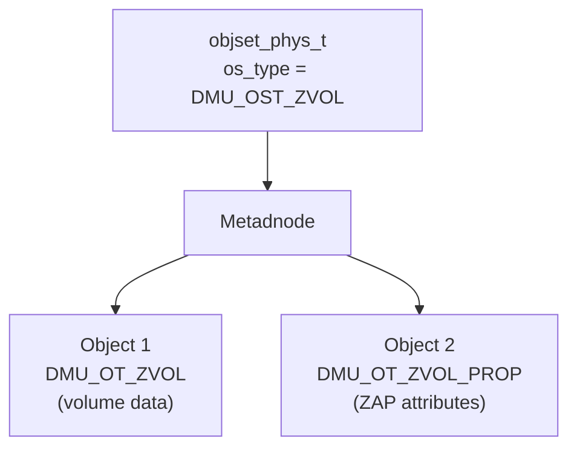

# Chapter 8: ZVOL (ZFS Volume)

> **Source:** `include/sys/zvol.h`, `include/sys/zvol_impl.h`, `include/sys/dmu.h`, `include/sys/fs/zfs.h`, `module/zfs/zvol.c`, `module/zcommon/zfs_prop.c`

A ZVOL (ZFS Volume) is a block device backed by a ZFS object set. Unlike ZPL filesystems, a ZVOL exposes a raw byte-addressable volume rather than directories and files.

## 8.1 Object Set Layout

A ZVOL is represented as an object set of type `DMU_OST_ZVOL`. The layout is minimal and uses two fixed object numbers:

| Object | Constant | Type | Description |
|--------|----------|------|-------------|
| 1 | `ZVOL_OBJ` | `DMU_OT_ZVOL` | Volume data (byte stream) |
| 2 | `ZVOL_ZAP_OBJ` | `DMU_OT_ZVOL_PROP` | ZAP with volume attributes |

## 8.2 Data Object (`DMU_OT_ZVOL`)

The data object stores the contents of the virtual block device as a byte array (`DMU_OT_ZVOL` is a `UINT8` data type). Offsets within the ZVOL map directly to byte offsets in this object.

- The **volblocksize** is the data block size of `ZVOL_OBJ`.
- The **block ID** for a given offset is `offset / volblocksize`.
- Standard DMU block pointer trees are used for the object (see [Chapter 2](02-block-pointers.md)).

## 8.3 Properties ZAP (`DMU_OT_ZVOL_PROP`)

Object 2 is a ZAP (`DMU_OT_ZVOL_PROP`) holding on-disk ZVOL attributes. The primary attribute is:

| Attribute | Type | Description |
|-----------|------|-------------|
| `size` | `uint64` | Volume size in bytes (`volsize` property) |

The user-facing `volsize` property is stored under the key `"size"` in this ZAP.

## 8.4 Size and Blocksize Rules

ZVOL sizing rules enforced by the on-disk format and property validation:

- `volsize` must be **non-zero** and a **multiple of volblocksize**.
- `volblocksize` must be a **power of two** between `SPA_MINBLOCKSIZE` (512 B) and `SPA_MAXBLOCKSIZE`.
- Sizes above `SPA_OLD_MAXBLOCKSIZE` (128 KiB) require `feature@large_blocks` and are limited by the `zfs_max_recordsize` tunable (default 1 MiB).
- `volblocksize` is a **one-time** property (`PROP_ONETIME`), set at creation and not changeable afterward.
- On 32-bit platforms, the maximum `volsize` is limited by `SPEC_MAXOFFSET_T`.

The default `volblocksize` is `ZVOL_DEFAULT_BLOCKSIZE` (16 KiB).

## 8.5 ZIL Interaction

ZVOLs use the ZIL for synchronous writes. ZIL records for ZVOLs target `ZVOL_OBJ` and replay only a small subset of transaction types:

- `TX_WRITE`
- `TX_TRUNCATE`
- `TX_CLONE_RANGE`

Other ZPL-specific transaction types are not used for ZVOL replay.
