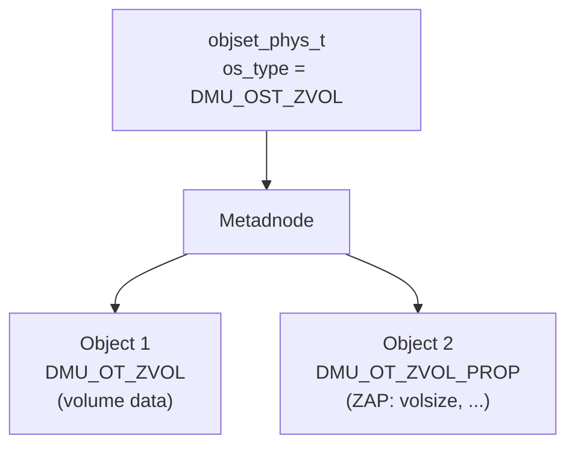

# Chapter 8: ZVOL (ZFS Volume)

> **Source:** `include/sys/zvol.h`, `include/sys/zvol_impl.h`, `module/zfs/zvol.c`

ZVOL (ZFS Volume) provides a mechanism for creating logical volumes that are exported as block devices. ZVOLs can be used like any other block device -- for example, as a swap device, to hold a UFS filesystem, or as an iSCSI target.

## On-Disk Format

A ZVOL is represented as an object set of type `DMU_OST_ZVOL` (value 3). The object set has a simple layout with two statically-assigned objects:

### Object 1: ZVOL Data

| Property | Value |
|----------|-------|
| **Object number** | 1 |
| **Object type** | `DMU_OT_ZVOL` (23) |
| **Description** | Stores the contents of the virtual block device |

The data object holds the actual block device contents. Data blocks are accessed by block ID, where each block ID maps to a range of bytes in the volume (determined by the volume's block size).

### Object 2: ZVOL Properties

| Property | Value |
|----------|-------|
| **Object number** | 2 |
| **Object type** | `DMU_OT_ZVOL_PROP` (24) |
| **Description** | ZAP object containing volume attributes |

The properties object is a ZAP object (see [Chapter 5](05-zap.md)) containing attributes associated with the volume. The primary attribute is:

| Attribute | Type | Description |
|-----------|------|-------------|
| `volsize` | `uint64` | Size of the volume in bytes |

The volume's block size is controlled by the `volblocksize` property (settable at creation time, between 512 bytes and 128 KB, defaulting to 8 KB). Unlike filesystem record sizes, the volume block size cannot be changed after the volume has been written to.
