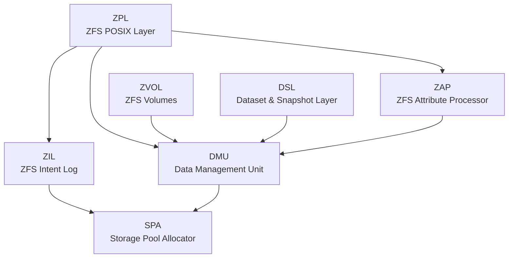

# ZFS On-Disk Format

This documentation describes the on-disk format of ZFS as implemented in [OpenZFS](https://github.com/openzfs/zfs). It is an independently written description derived from the publicly available OpenZFS source code.

## Overview

ZFS is a filesystem and volume manager that provides 128-bit addressability, provable data integrity through checksumming, a copy-on-write (COW) transactional model, and integrated volume management. Unlike traditional filesystems, ZFS eliminates the concept of volumes by grouping storage devices into a shared pool from which filesystems draw space dynamically.

The copy-on-write design ensures that on-disk data is never overwritten in place. All updates are written to new locations and committed atomically in transaction groups, guaranteeing a consistent on-disk state at all times.

## Architecture

The ZFS on-disk format is defined by seven layered software components:

| Layer | Purpose | Chapters |
|-------|---------|----------|
| **SPA** (Storage Pool Allocator) | Manages vdevs, labels, uberblocks, block allocation, and I/O | [Chapter 1](01-vdevs.md), [Chapter 2](02-block-pointers.md), [Chapter 9](09-space-maps.md), [Chapter 11](11-raidz.md), [Chapter 12](12-special-vdevs.md), [Chapter 15](15-l2arc.md), [Chapter 16](16-pool-state.md) |
| **DMU** (Data Management Unit) | Groups blocks into objects and object sets | [Chapter 3](03-dmu.md) |
| **DSL** (Dataset and Snapshot Layer) | Manages datasets, snapshots, clones, and their relationships | [Chapter 4](04-dsl.md) |
| **ZAP** (ZFS Attribute Processor) | Stores name-value pair attributes in objects | [Chapter 5](05-zap.md) |
| **ZPL** (ZFS POSIX Layer) | Presents DMU objects as a POSIX filesystem | [Chapter 6](06-zpl.md) |
| **ZIL** (ZFS Intent Log) | Records synchronous operations for crash recovery | [Chapter 7](07-zil.md) |
| **ZVOL** (ZFS Volume) | Exports an object set as a block device | [Chapter 8](08-zvol.md) |

## How Data is Located

The path from raw storage to user data follows a fixed traversal:

1. **Vdev Labels** (256 KB structures at known positions on each device) contain the pool configuration and an array of uberblocks.
2. The **Uberblock** with the highest valid transaction group number (`ub_txg`) and a valid `ub_magic` is the active uberblock. If multiple uberblocks share the same `ub_txg`, the one with the latest `ub_timestamp` wins. Its `ub_rootbp` field is a block pointer to the Meta Object Set (MOS).
3. The **MOS** (type `DMU_OST_META`) contains the object directory at object number 1. The object directory is a ZAP object with entries for `root_dataset`, `config`, and other pool-wide metadata.
4. The **root_dataset** entry points to the root DSL directory, from which all datasets (filesystems, snapshots, volumes) can be reached.
5. Each dataset points to an **object set** containing the actual filesystem objects (files, directories, etc.).

## Reference Files

All source references in this documentation point to files in the OpenZFS source tree:

- Headers: `include/sys/*.h`
- Implementation: `module/zfs/*.c`
- Common definitions: `module/zcommon/*.c`

## Document Organization

- [Conventions](conventions.md) -- Notation, byte order, diagram conventions
- [Glossary](glossary.md) -- Terms, acronyms, type enumerations
- [Chapter 1: Virtual Devices, Labels, and Boot Block](01-vdevs.md)
- [Chapter 2: Block Pointers and Indirect Blocks](02-block-pointers.md)
- [Chapter 3: Data Management Unit](03-dmu.md)
- [Chapter 4: Dataset and Snapshot Layer](04-dsl.md)
- [Chapter 5: ZFS Attribute Processor](05-zap.md)
- [Chapter 6: ZFS POSIX Layer](06-zpl.md)
- [Chapter 7: ZFS Intent Log](07-zil.md)
- [Chapter 8: ZVOL](08-zvol.md)
- [Chapter 9: Space Maps and Metaslabs](09-space-maps.md)
- [Chapter 10: Native Encryption](10-encryption.md)
- [Chapter 11: RAID-Z and dRAID](11-raidz.md)
- [Chapter 12: Allocation Classes and Device Removal](12-special-vdevs.md)
- [Chapter 13: Feature Flags and Compatibility](13-feature-flags.md)
- [Chapter 14: Deduplication Tables and Block Cloning](14-dedup-and-cloning.md)
- [Chapter 15: Persistent L2ARC Cache](15-l2arc.md)
- [Chapter 16: Pool Operations State](16-pool-state.md)
